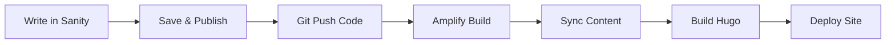

# 🚀 AWS Amplify Deployment Guide

Deploy your **Sanity Studio + Hugo blog** to AWS Amplify with automated content syncing!

## 🏗️ **Architecture Overview**

```
GitHub Repo → AWS Amplify → Deployed Site
     ↓              ↓
Sanity Studio → Content Sync → Hugo Build
```

**Workflow:**
1. Content created in **Sanity Studio**
2. **Amplify** pulls from GitHub on push
3. **Sync script** fetches content from Sanity
4. **Hugo** builds static site
5. **Amplify** deploys to CDN

## 📋 **Prerequisites**

✅ GitHub repository with Sanity + Hugo setup  
✅ Sanity project created (`ouf5coh1`)  
✅ AWS account with Amplify access  

## 🚀 **Step 1: Deploy to Amplify**

### **1.1 Connect Repository**

1. Go to [AWS Amplify Console](https://console.aws.amazon.com/amplify/)
2. Click **"New app"** → **"Host web app"**
3. Select **GitHub** as source
4. Choose repository: `LerianStudio/blog`
5. Select branch: `main`

### **1.2 Configure Build Settings**

Amplify should auto-detect our `amplify.yml` file, but verify these settings:

**App Settings:**
- **App name:** `lerian-blog`
- **Environment:** `production` 
- **Branch:** `main`

**Build Settings:** (automatically loaded from `amplify.yml`)
```yaml
version: 1
frontend:
  phases:
    preBuild:
      commands:
        # Install Node.js dependencies for Sanity sync
        - npm ci
        # Sync content from Sanity to Hugo markdown files  
        - npm run sync
        # Install Hugo
        - wget https://github.com/gohugoio/hugo/releases/download/v0.147.5/hugo_extended_0.147.5_linux-amd64.tar.gz
        - tar -xzf hugo_extended_0.147.5_linux-amd64.tar.gz
        - mv hugo /usr/local/bin/
        - hugo version
    build:
      commands:
        # Build Hugo site with minification
        - hugo --minify
    postBuild:
      commands:
        - echo "✅ Build completed successfully!"
  artifacts:
    baseDirectory: public
    files:
      - '**/*'
  cache:
    paths:
      - node_modules/**/*
      - sanity/node_modules/**/*
```

### **1.3 Set Environment Variables**

In Amplify Console → App Settings → Environment Variables:

| Variable             | Value        | Description            |
| -------------------- | ------------ | ---------------------- |
| `SANITY_PROJECT_ID`  | `ouf5coh1`   | Your Sanity project ID |
| `SANITY_DATASET`     | `production` | Sanity dataset name    |
| `SANITY_API_VERSION` | `2023-05-03` | Sanity API version     |

### **1.4 Configure App Settings**

**Advanced Settings:**
- **Node.js Version:** `18` (or latest LTS)
- **Hugo Version:** Auto-installed in build
- **Build Timeout:** `15 minutes`

## 🔄 **Step 2: Automated Deployments**

### **2.1 Trigger Deployments**

Deployments trigger automatically on:
- ✅ **Git push** to main branch
- ✅ **Manual trigger** in Amplify console
- 🔄 **Webhook** (for Sanity content updates)

### **2.2 Build Process**

```bash
# 1. Install dependencies
npm ci

# 2. Sync content from Sanity  
npm run sync
# → Fetches published posts
# → Converts to Hugo markdown
# → Saves to content/posts/

# 3. Install Hugo
wget https://github.com/gohugoio/hugo/releases/...
# → Downloads Hugo extended binary
# → Makes it available globally

# 4. Build site
hugo --minify
# → Generates static site in public/
# → Minifies CSS/JS/HTML

# 5. Deploy
# → Amplify serves files from public/
```

## 🔧 **Step 3: Advanced Configuration**

### **3.1 Custom Domain**

1. **Amplify Console** → **Domain Management**
2. **Add domain** → Enter your domain
3. **Configure DNS** → Follow Amplify instructions
4. **SSL Certificate** → Auto-provisioned

### **3.2 Redirects & Rewrites**

Create `public/_redirects` (auto-generated by Hugo):
```
# Handle old URLs
/admin/* https://ouf5coh1.sanity.studio/:splat 301
/blog/* /posts/:splat 301

# SPA fallback
/*    /index.html   200
```

### **3.3 Performance Optimization**

**Amplify Optimizations:**
- ✅ **GZIP compression** (automatic)
- ✅ **CDN caching** (automatic)  
- ✅ **Image optimization** (via Sanity CDN)
- ✅ **Hugo minification** (--minify flag)

## 🔗 **Step 4: Sanity Integration**

### **4.1 Access Sanity Studio**

**Development:** http://localhost:3333/  
**Production:** Deploy with `npm run studio:deploy`

### **4.2 Content Workflow**



**Manual Content Update:**
1. Create/edit content in Sanity Studio
2. Push any code change to trigger rebuild
3. Amplify syncs content during build

### **4.3 Webhooks (Advanced)**

For real-time content updates without code changes:

1. **Sanity Dashboard** → **API** → **Webhooks**
2. **Create webhook** with Amplify trigger URL
3. **Filter:** `_type == "post"`
4. **Method:** `POST`

## 📊 **Monitoring & Debugging**

### **4.1 Build Logs**

Monitor builds in **Amplify Console**:
- ✅ **preBuild** - Dependencies + Sanity sync
- ✅ **build** - Hugo site generation  
- ✅ **postBuild** - Deployment preparation

### **4.2 Common Issues**

| Issue               | Solution                       |
| ------------------- | ------------------------------ |
| **Sync fails**      | Check Sanity env vars          |
| **Hugo not found**  | Verify wget/tar commands       |
| **Build timeout**   | Increase timeout to 15min      |
| **Missing content** | Check `draft: false` in Sanity |
| **404 errors**      | Verify Hugo baseURL config     |

### **4.3 Debug Commands**

```bash
# Local testing
npm run sync          # Test Sanity sync
npm run preview       # Test full workflow
hugo --buildDrafts    # Include draft content

# Amplify debugging  
aws amplify list-apps
aws logs tail /aws/amplify/[app-id]
```

## 🎯 **Performance Metrics**

**Expected Performance:**
- **Build Time:** 2-4 minutes
- **Sync Time:** 10-30 seconds  
- **Deploy Time:** 1-2 minutes
- **Page Load:** <2 seconds (optimized)

**Optimization Tips:**
- ✅ Minimize Sanity queries
- ✅ Use Hugo's image processing
- ✅ Enable Amplify performance features
- ✅ Optimize images in Sanity

## 🔗 **Useful Commands**

```bash
# Development
npm run studio        # Start Sanity Studio
npm run sync         # Sync content locally
npm run preview      # Full local workflow

# Deployment
git push origin main  # Trigger Amplify build
npm run studio:deploy # Deploy Sanity Studio

# Debugging
hugo --buildDrafts   # Include drafts
hugo --verbose       # Detailed build logs
```

## 🎉 **Final Result**

After deployment, you'll have:

- 🌐 **Public blog** at your Amplify URL
- 📝 **Sanity Studio** for content management  
- 🔄 **Automated deployments** on code changes
- ⚡ **Fast, optimized** static site
- 📱 **Mobile-responsive** design
- 🔒 **HTTPS** with automatic SSL

**Your blog is now live with a professional CMS workflow!** 🚀

---

## 📞 **Support**

- **Amplify Docs:** https://docs.amplify.aws/
- **Hugo Docs:** https://gohugo.io/hosting-and-deployment/
- **Sanity Docs:** https://www.sanity.io/docs
- **Build Issues:** Check Amplify Console logs 