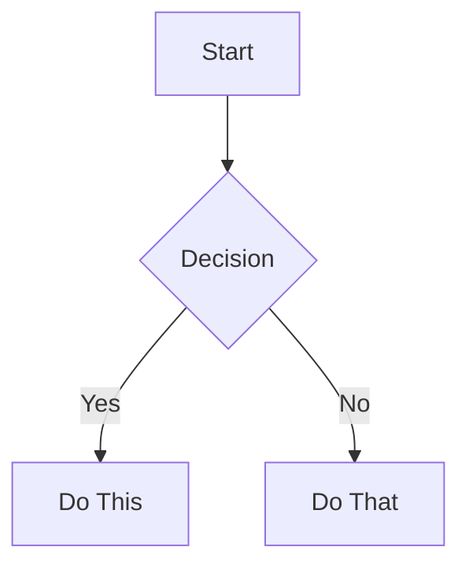

# Lerian Studio Blog

A technical blog focused on financial technology, software architecture, and engineering best practices. Built with Hugo and featuring a retro terminal theme.

## 🚀 Quick Start

### Option 1: Edit via Decap CMS (No coding required)
1. Visit `https://your-domain.com/admin/`
2. Login with your GitHub account
3. Create, edit, and publish posts through the visual interface
4. Changes are automatically deployed via AWS Amplify

### Option 2: Edit via GitHub (Simple)
1. Navigate to the `content/posts/` folder on GitHub
2. Click "Create new file" or edit existing posts
3. Write in Markdown format
4. Commit changes to trigger automatic deployment

### Option 3: Local Development (Advanced)

#### Prerequisites
- [Hugo](https://gohugo.io/installation/) (v0.121.1 or later)
- Git
- Text editor (VS Code recommended)

#### Setup
```bash
# Clone the repository
git clone https://github.com/lerianstudio/blog.git
cd blog

# Run Hugo development server
hugo server -D

# View at http://localhost:1313
```

## 📝 Creating Content

### Via Decap CMS
1. Go to `/admin/` on your deployed site
2. Click "New Post" 
3. Fill in the fields:
   - Title, Date, Description
   - Tags and Categories (optional)
   - Write content in the visual editor
4. Save as draft or publish immediately

### Via Markdown Files

Create a new post in `content/posts/`:

```markdown
---
title: "My New Post"
date: 2025-05-27T20:00:00-03:00
draft: false
description: "A brief description of the post"
tags: ["architecture", "golang"]
categories: ["technical"]
---

Your content here...
```

### Content Structure
- `content/posts/` - Published blog posts
- `content/about.md` - About page
- `content/contact.md` - Contact page  
- `raw/articles/` - Draft articles and ideas

## 🎨 Features

- **Terminal Theme**: Retro aesthetic with dark background (#000000) and yellow accents (#ffff00)
- **Mermaid Diagrams**: Support for flowcharts and diagrams with automatic theme detection
- **Syntax Highlighting**: Beautiful code blocks with copy functionality
- **Keyboard Shortcuts**: 
  - `h` - Home
  - `t` - Tags
  - `i` - Search
- **SEO Optimized**: Meta tags, Open Graph, and structured data
- **Fast Performance**: Static site with AWS CloudFront CDN

## 🛠️ Technical Stack

- **Static Site Generator**: Hugo (Go-based)
- **Theme**: hugo-theme-terminal (customized)
- **CMS**: Decap CMS (formerly Netlify CMS)
- **Hosting**: AWS Amplify
- **CDN**: AWS CloudFront
- **CI/CD**: GitHub Actions

## 📁 Project Structure

```
blog/
├── content/          # Markdown content files
│   ├── posts/       # Blog posts
│   ├── about.md     # About page
│   └── contact.md   # Contact page
├── layouts/         # Custom Hugo templates
├── static/          # Static files (images, CSS, JS)
│   └── admin/       # Decap CMS files
├── themes/          # Hugo themes
├── raw/articles/    # Draft articles
└── hugo.toml        # Hugo configuration
```

## 🚀 Deployment

### Automatic Deployment
Every push to the `main` branch triggers:
1. GitHub Actions workflow
2. Hugo builds the static site
3. AWS Amplify deploys to production
4. CloudFront CDN distributes globally

### Manual Build
```bash
# Build for production
hugo --minify

# Output in public/ directory
```

## ⚙️ Configuration

### Hugo Configuration
Edit `hugo.toml`:
- Site title, description, author
- Theme settings
- Menu items
- Social links

### CMS Configuration  
Edit `static/admin/config.yml`:
- Content collections
- Field definitions
- Media settings
- Preview options

## 🔐 Access Control

### Decap CMS Authentication
- Uses GitHub OAuth
- Only repository contributors can edit
- Optional: Configure GitHub organization SAML for Google SSO

### Team Access
1. Add team members as GitHub repository collaborators
2. They can access `/admin/` with their GitHub account
3. All changes tracked in Git history

## 📊 Writing Tips

### Markdown Features
- Headers: `# H1`, `## H2`, `### H3`
- Bold: `**text**`
- Italic: `*text*`
- Code blocks: ` ```language `
- Links: `[text](url)`
- Images: ``

### Mermaid Diagrams
````markdown

````

### Front Matter Options
```yaml
title: "Post Title"          # Required
date: 2025-05-27            # Required
draft: false                # false to publish
description: "Summary"       # For SEO
tags: ["tag1", "tag2"]      # Categorization
categories: ["category"]     # Main category
author: "Your Name"         # Override default
image: "/images/cover.jpg"  # Featured image
```

## 🐛 Troubleshooting

### Local Development Issues
- **Port already in use**: Change port with `hugo server -p 1314`
- **Theme not loading**: Run `git submodule update --init`
- **Build errors**: Check Hugo version with `hugo version`

### CMS Issues
- **Can't login**: Check GitHub permissions
- **404 on /admin/**: Ensure deployment includes static files
- **Preview not working**: Update site URLs in config.yml

## 📚 Resources

- [Hugo Documentation](https://gohugo.io/documentation/)
- [Decap CMS Guide](https://decapcms.org/docs/)
- [Markdown Guide](https://www.markdownguide.org/)
- [AWS Amplify Docs](https://docs.amplify.aws/)

## 🤝 Contributing

1. Fork the repository
2. Create a feature branch (`git checkout -b feature/amazing-feature`)
3. Commit changes (`git commit -m 'Add amazing feature'`)
4. Push to branch (`git push origin feature/amazing-feature`)
5. Open a Pull Request

## 📝 License

This project is proprietary to Lerian Studio. All rights reserved.

---

Built with ❤️ by [Lerian Studio](https://lerianstudio.com)