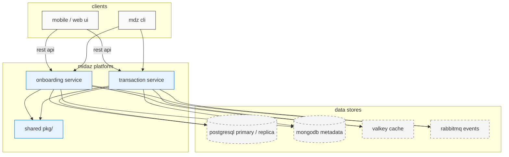
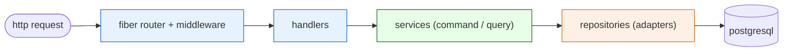
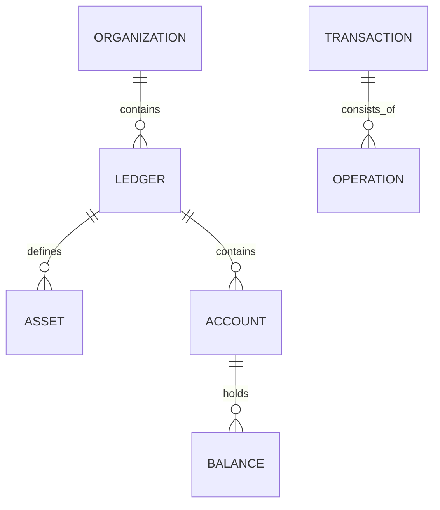
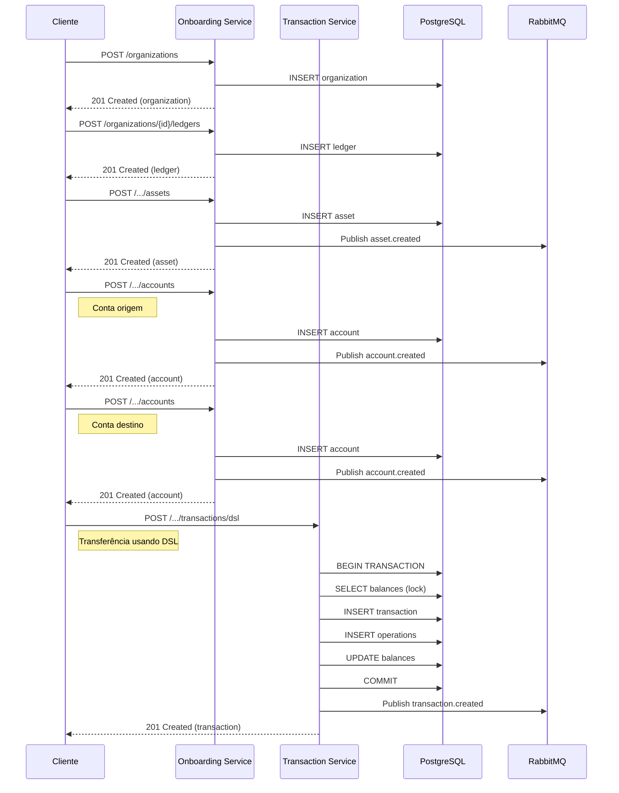
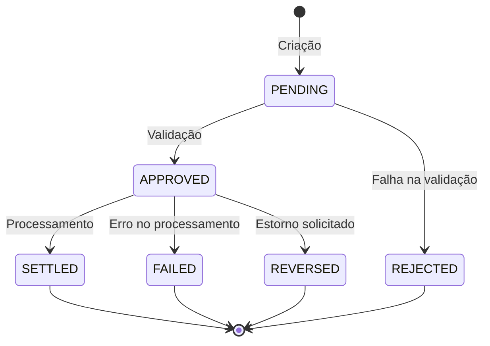

# midaz: anatomia de um core banking open-source

> uma análise técnica da arquitetura, decisões de design e trade-offs do midaz

## sumário

- [contexto](#contexto)
- [principais drivers](#principais-drivers)
- [visão de alto nível](#visão-de-alto-nível)
- [domínio & entidades centrais](#domínio--entidades-centrais)
- [fluxo de trabalho completo](#fluxo-de-trabalho-completo)
- [implementação do CQRS](#implementação-do-cqrs)
- [ciclo de vida das transações](#ciclo-de-vida-das-transações)
- [validação e middleware](#validação-e-middleware)
- [gerenciamento de transações](#gerenciamento-de-transações)
- [observabilidade & telemetria](#observabilidade--telemetria)
- [testes & confiança](#testes--confiança)
- [segurança por padrão](#segurança-por-padrão)
- [escalabilidade](#escalabilidade)
- [multi-tenancy](#multi-tenancy)
- [desafios e lições aprendidas](#desafios-e-lições-aprendidas)
- [próximos passos & como contribuir](#próximos-passos--como-contribuir)

## contexto

fintechs e bancos digitais precisam de um core banking flexível, confiável e de baixo custo operacional. o midaz nasceu para resolver esse problema, oferecendo:

- **ledgers multi-tenant**: isolamento contábil entre clientes
- **transações atômicas**: garantia de débito/crédito consistente
- **multi-currency**: suporte nativo a múltiplas moedas/assets
- **extensibilidade**: metadata flexível para casos específicos
- **auditabilidade**: rastreamento completo de operações
- **api-first**: integração simples via rest

a seguir, as escolhas que mais impactam a forma como o midaz é construído e operado.

### principais drivers

| decisão                                        | motivação                                                                                                                              |
| ---------------------------------------------- | -------------------------------------------------------------------------------------------------------------------------------------- |
| **microservices** `onboarding` & `transaction` | separar domínio estrutural (cadastro) do domínio de movimentação de valor; permite escalar independentemente e reduzir _blast radius_. |
| **hexagonal architecture** (ports & adapters)  | isolar regras de negócio de detalhes de infraestrutura (db, http, rabbitmq). facilita testes e trocas de tecnologia.                   |
| **cqrs** (command/query)                       | clareza entre operações de leitura e escrita; tuning independente (ex: replicas read-only).                                            |
| **shared kernel** `pkg/`                       | evitar divergência de modelos, erros e helpers entre serviços.                                                                         |
| **postgresql** (forte consistência)            | modelo relacional e transacional ideal para contabilidade.                                                                             |
| **mongodb** (metadata)                         | armazenar documentos dinâmicos sem alterar schema relacional.                                                                          |
| **valkey**                                     | cache de baixa latência, idempotency keys e locks distribuidos.                                                                        |
| **rabbitmq**                                   | orquestração de eventos de domínio e integração assíncrona.                                                                            |
| **go fiber**                                   | alto desempenho, sintaxe familiar à galera node/express, compatível com `context.Context`.                                             |
| **opentelemetry + structured logging**         | _observability first_: rastreamento de transações ponta a ponta.                                                                       |

> **trade-offs**: mais serviços = mais complexidade operacional. mitigamos com docker compose local, k8s helm charts e pipelines automatizados. consistência eventual em fluxos assíncronos é tratada (em evolução) via _outbox pattern_.

#### por que essas escolhas e não outras?

**postgresql _versus_ mysql**  
preferimos postgres por três razões principais: (1) semântica transacional mais avançada (mvcc completa, `serializable` forte), (2) tipos numéricos de alta precisão (`numeric(p,s)`) – críticos para contabilidade –, e (3) extensões maduras (partitioning declarativo, `pgcrypto`, `logical replication`). além disso, o ecossistema go (sqlc/pgx) brilha com postgres.

**postgresql _versus_ cockroachdb ou foundationdb**  
cockroach traz _scale-out_ automático, porém adiciona latência de consenso **raft** em todo write; nosso perfil de tráfego é read-heavy mas com picos de write que já cabem em vertical-scale + replica read-only. trocaríamos complexidade operacional (tuning de zonas, upgrades, licenças e custos altos) por um benefício que não precisamos (scale-out). foundationdb é poderoso, mas obriga a construir layers ou ORMs específicos (ex: record-layer). preferimos manter SQL padrão e uma curva de aprendizagem menor para o nosso time. a tecnologia em databases está evoluindo a passos larguíssimos, e vamos nos manter atentos (hexagonal nos dá essa vantagem e peace-of-mind).

**dois microservices (coarse-grained) _versus_ monolito ou dezenas de micros**  
começamos com um monorepo, mas dividimos em dois serviços alinhados ao domínio: _cadastro_ e _movimentação_. isso dá autonomia de escala (o serviço de transação exige tunagem diferente) e separa ciclos de deploy. evitamos o _death by a thousand microservices_ mantendo tamanho de time e domínios sob controle; shared-kernel (`pkg/`) reduz duplicação.

**cqrs _versus_ crud tradicional**  
separar comandos (escrita) de queries (leitura) traz clareza de código, facilita testes e permite otimizações específicas. por exemplo: read-replicas para queries de relatórios, enquanto commands usam o primary com transações. evitamos a complexidade de event sourcing puro (por enquanto), mas mantemos a porta aberta via eventos de domínio.

**hexagonal _versus_ clean/onion/layered**  
a arquitetura hexagonal (ports & adapters) nos dá o benefício de isolar a lógica de negócio (core) dos detalhes técnicos (adaptadores). comparada com clean architecture, é menos prescritiva sobre camadas internas e mais focada na inversão de dependência nas bordas. diferente da layered, não impõe uma hierarquia rígida (ui → business → data). isso nos permite testar regras de negócio sem mocks complexos e trocar implementações (ex: postgres → cockroach) com impacto mínimo.

**valkey _versus_ redis**  
valkey é um fork do redis focado em performance e compatibilidade com a API redis, mas com licença mais permissiva (BSD-3). mantém as mesmas características que precisamos: baixa latência, estruturas de dados versáteis, pub/sub e locks distribuídos. a decisão foi principalmente pela licença e pela promessa de melhor suporte a clusters.

**rabbitmq _versus_ kafka**  
rabbitmq tem menor footprint operacional para nosso volume atual de mensagens. priorizamos confiabilidade de entrega (filas duráveis, acks) sobre throughput extremo. kafka seria over-engineering para nosso caso, com maior custo de infraestrutura e complexidade operacional. se o volume crescer significativamente, a arquitetura permite trocar o broker com impacto isolado aos adaptadores.

**mongodb _versus_ postgresql jsonb**  
embora o postgres ofereça `jsonb` com bom desempenho, escolhemos mongodb para metadados por: (1) melhor suporte a consultas complexas em documentos aninhados, (2) schema flexível sem migrações para novos campos, e (3) isolamento de carga – operações intensivas em metadados não impactam o banco transacional.

**go fiber _versus_ gin**  
fiber e gin são frameworks http de alta performance em go. escolhemos fiber por sua API inspirada no express.js (familiar para devs com background em node), suporte nativo a middleware e compatibilidade com `context.Context` do go. a diferença de performance é marginal para nosso caso de uso.

## visão de alto nível

### diagrama geral



### comunicação entre camadas



os _middlewares_ principais:

- `withBody`: decodifica json, valida struct com `validator.v9` e rejeita campos inesperados.
- `parseUUIDPathParameters`: garante que path params são uuids válidos.
- `withError`: mapeia erros de negócio (`pkg/errors`) → http overrides consistentes.

## domínio & entidades centrais

### er-diagram



| entidade                | papel                                                  |
| ----------------------- | ------------------------------------------------------ |
| **organization**        | tenant raiz; agrupa ledgers.                           |
| **ledger**              | namespace contábil; define regras e moeda base.        |
| **asset**               | unidade de valor (brl, btc, pontos).                   |
| **account**             | representação de saldo para um asset dentro do ledger. |
| **balance**             | snapshot atual de um account-asset.                    |
| **transaction**         | intenção de mover valor; agrupa operações.             |
| **operation**           | débito ou crédito atômico que afeta balances.          |
| **portfolio / segment** | tags para agrupar accounts (não ilustrado).            |

## fluxo de trabalho completo

abaixo um exemplo de fluxo completo de uma transação no midaz, desde a criação das entidades até a execução de uma transferência:



## implementação do CQRS

a separação command/query no midaz vai além da organização de código - reflete uma separação clara de responsabilidades:

| aspecto | command | query |
| ------- | ------- | ----- |
| **propósito** | alterar estado | ler estado |
| **validação** | regras de negócio completas | mínima (apenas formato) |
| **transações** | ACID com locks | read-only, sem locks |
| **performance** | otimizado para consistência | otimizado para velocidade |
| **cache** | invalidação | leitura |

exemplo prático:
- `command.CreateAccount`: valida regras, verifica duplicidade, persiste, publica eventos
- `query.GetAccountByID`: apenas busca e formata, potencialmente de réplica read-only

esta separação permite:
- escalar leituras independentemente (réplicas)
- simplificar o código de cada operação
- aplicar políticas de cache diferentes
- facilitar testes unitários

## ciclo de vida das transações

uma transação financeira no midaz passa por vários estados, com transições bem definidas:



cada transição:
- é auditada (quem, quando, por quê)
- pode disparar eventos de domínio
- segue regras específicas (ex: só pode reverter transações aprovadas)
- atualiza saldos quando apropriado

## validação e middleware

o midaz implementa uma camada robusta de validação através de middlewares personalizados que garantem a integridade dos dados antes que cheguem aos handlers:

```go
// Exemplo simplificado do middleware WithBody
func WithBody(input interface{}) fiber.Handler {
    return func(c *fiber.Ctx) error {
        // 1. Parse do JSON para a struct
        if err := c.BodyParser(input); err != nil {
            return BadRequest(c, err)
        }
        
        // 2. Detecta campos desconhecidos/extras
        if err := checkUnknownFields(c.Body(), input); err != nil {
            return BadRequest(c, ValidationUnknownFieldsError(...))
        }
        
        // 3. Validação com go-playground/validator
        validate := validator.New()
        if err := validate.Struct(input); err != nil {
            return BadRequest(c, ValidationKnownFieldsError(...))
        }
        
        // 4. Armazena o objeto validado no contexto
        c.Locals("input", input)
        
        // 5. Passa para o próximo handler
        return c.Next()
    }
}
```

este padrão garante que:
- handlers só recebem dados válidos e tipados
- erros de validação são consistentes em toda a API
- campos extras são rejeitados (prevenção de poluição)
- regras complexas são aplicadas uniformemente

## gerenciamento de transações

o midaz implementa transações ACID no nível do serviço, garantindo consistência mesmo em operações complexas:

```go
// Exemplo simplificado de um serviço com transação
func (s *Service) CreateTransaction(ctx context.Context, input model.Transaction) (*model.Transaction, error) {
    // Inicia transação
    tx, err := s.db.BeginTx(ctx, nil)
    if err != nil {
        return nil, err
    }
    
    // Garante rollback em caso de erro
    defer func() {
        if r := recover(); r != nil {
            tx.Rollback()
            panic(r)
        }
    }()
    
    // Verifica saldo com lock
    balance, err := s.balanceRepo.FindWithLock(ctx, tx, input.AccountID)
    if err != nil {
        tx.Rollback()
        return nil, err
    }
    
    // Valida regras de negócio
    if balance.Available < input.Amount {
        tx.Rollback()
        return nil, ErrInsufficientFunds
    }
    
    // Cria transação
    transaction, err := s.transactionRepo.Create(ctx, tx, input)
    if err != nil {
        tx.Rollback()
        return nil, err
    }
    
    // Atualiza saldo
    balance.Available -= input.Amount
    if err := s.balanceRepo.Update(ctx, tx, balance); err != nil {
        tx.Rollback()
        return nil, err
    }
    
    // Commit
    if err := tx.Commit(); err != nil {
        return nil, err
    }
    
    return transaction, nil
}
```

este padrão assegura:
- atomicidade: todas as operações são aplicadas ou nenhuma é
- consistência: regras de negócio são validadas dentro da transação
- isolamento: locks previnem condições de corrida
- durabilidade: commit só retorna após persistência

## observabilidade & telemetria

- **structured logging**: `libCommons.NewLoggerFromContext` injeta span-id, tenant etc.
- **tracing**: openTelemetry exporta para grafana tempo de transação ponta-a-ponta.
- **metrics**: contador de requisições, histogramas de latência e healthchecks prontos pro prometheus.

## testes & confiança

| camada   | estratégia                                                        |
| -------- | ----------------------------------------------------------------- |
| services | unit tests com repositórios fake/mock.                            |
| adapters | integração usando postgres/mongo descartáveis (`testcontainers`). |
| handlers | supertest em fiber + mocks.                                       |
| e2e      | compose + go test, cobrindo workflow de débito/crédito.           |

## segurança por padrão

- jwt (casdoor) validado por middleware `lib-auth`; claims de tenant e roles no `context`.
- feature flag `PLUGIN_AUTH_ENABLED=false` agiliza desenvolvimento local.
- todos os ids são **uuid v4**, evitando _enumeration attacks_.

## escalabilidade

a arquitetura do midaz foi projetada para escalar horizontalmente:

- **separação de serviços**: onboarding (baixo volume) vs transaction (alto volume)
- **stateless**: serviços sem estado facilitam replicação
- **caching**: valkey para dados frequentes (idempotency keys, locks)
- **database scaling**:
  - vertical: primary com recursos dedicados
  - horizontal: read replicas para queries
  - particionamento: cada ledger pode ter seu próprio schema
- **async processing**: operações pesadas via filas (rabbitmq)
- **observability**: métricas detalhadas para identificar gargalos

## multi-tenancy

o midaz implementa isolamento multi-tenant em vários níveis:

1. **isolamento lógico**:
   - organização como tenant raiz
   - ledger como namespace contábil
   - filtros automáticos em todas as queries

2. **isolamento de dados**:
   - schema por tenant (opcional)
   - particionamento de tabelas por organização/ledger
   - índices otimizados para filtros de tenant

3. **isolamento de recursos**:
   - rate limiting por tenant
   - quotas configuráveis
   - monitoramento de uso por tenant

4. **isolamento de segurança**:
   - JWT com claims de tenant
   - validação de acesso em middleware
   - auditoria por tenant

## desafios e lições aprendidas

durante o desenvolvimento do midaz, enfrentamos e superamos diversos desafios:

- **precisão numérica**: escolhemos `numeric(p,s)` do postgres para evitar erros de arredondamento comuns em floats
- **concorrência**: implementamos locks otimistas (version) e pessimistas (select for update) para diferentes cenários
- **consistência eventual**: adotamos eventos de domínio para sincronização, com retry e idempotência
- **performance de queries**: índices compostos específicos para padrões de acesso comuns
- **observabilidade**: structured logging + opentelemetry desde o início, não como afterthought
- **testabilidade**: injeção de dependências e interfaces mockáveis em todos os níveis

## próximos passos & como contribuir

1. **outbox pattern** nativo → entrega garantida de eventos (work in progress).
2. **event sourcing** opcional → trilhas de auditoria completas.
3. **extensões**: suportar novos tipos de operação; campo `metadata` já existe no modelo.

curtiu? ⭐ o repo, abra uma _issue_ ou junte-se ao nosso discord. feedbacks e PRs são sempre bem-vindos 🤘
