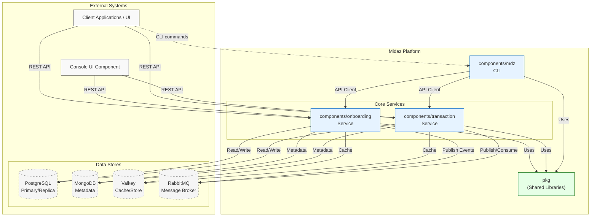
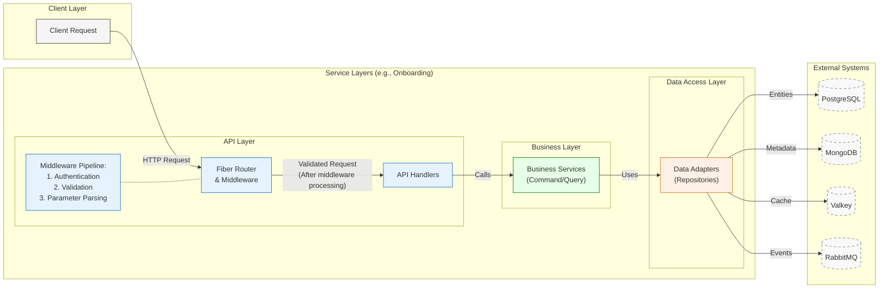
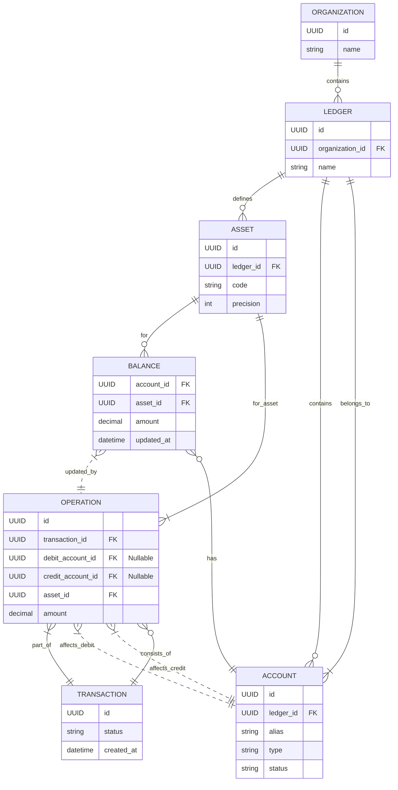
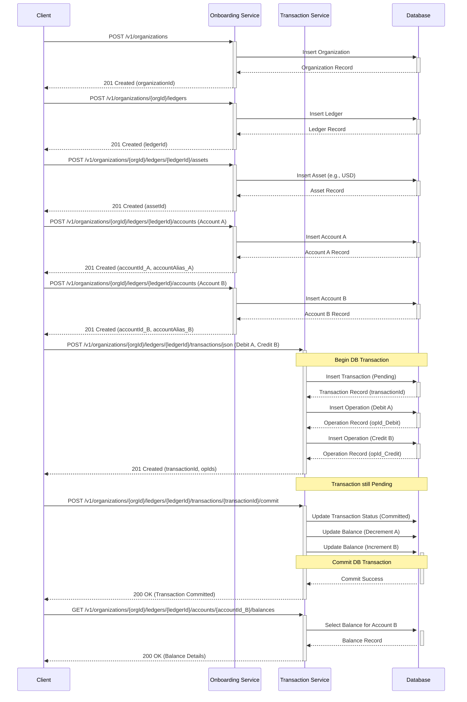

# Midaz Architecture Analysis

## Table of Contents
- [Midaz Architecture Analysis](#midaz-architecture-analysis)
  - [Table of Contents](#table-of-contents)
  - [Executive Summary](#executive-summary)
  - [System Overview](#system-overview)
  - [Directory Structure](#directory-structure)
  - [Core Components](#core-components)
    - [Onboarding Service](#onboarding-service)
    - [Transaction Service](#transaction-service)
    - [CLI Tool](#cli-tool)
    - [Shared Packages](#shared-packages)
  - [Architectural Patterns](#architectural-patterns)
    - [Layered Architecture](#layered-architecture)
    - [Microservices Architecture](#microservices-architecture)
    - [CQRS Pattern](#cqrs-pattern)
  - [Service Implementation Details](#service-implementation-details)
    - [Entry Point and Bootstrap](#entry-point-and-bootstrap)
    - [API Endpoints & Routing](#api-endpoints--routing)
    - [API Handlers](#api-handlers)
    - [Business Services](#business-services)
    - [Data Adapters](#data-adapters)
  - [Service Communication](#service-communication)
    - [Synchronous Communication](#synchronous-communication)
    - [Asynchronous Communication](#asynchronous-communication)
  - [Data Models](#data-models)
  - [API Design](#api-design)
  - [Error Handling](#error-handling)
  - [Telemetry and Observability](#telemetry-and-observability)
  - [Deployment Model](#deployment-model)
  - [Testing Strategy](#testing-strategy)
  - [Example Workflow](#example-workflow)
  - [Key Design Decisions](#key-design-decisions)
  - [Storage Backends](#storage-backends)
  - [Security](#security)
  - [Potential Improvement Areas](#potential-improvement-areas)

## Executive Summary

Midaz is a Go-based financial ledger platform structured as a set of microservices that provide accounting and transaction management capabilities. The architecture follows a clean, layered approach with clear separation of concerns between API handling, business logic, and data access layers. The system is built around core domain entities including Organizations, Ledgers, Accounts, Assets, and Transactions, with a focus on ensuring transactional integrity and audit capabilities.

The platform uses industry-standard technologies such as **PostgreSQL** (with primary and read-replica instances) for relational data, **MongoDB** for schemaless metadata, **Valkey** (Redis-compatible) for caching, and **RabbitMQ** for asynchronous messaging. API surfaces are RESTful, built on the Go Fiber framework with **Casdoor-based authentication middleware**, rigorous validation, and **OpenTelemetry** instrumentation. The codebase demonstrates mature engineering practices including centralized error handling, dependency injection, and structured logging.

## System Overview



The primary components identified are:

- **`components/onboarding`**: Manages entities like Organizations, Ledgers, Accounts, Assets, Portfolios, and Segments. Exposes a REST API.
- **`components/transaction`**: Manages Transactions, Operations, Balances, and Asset Rates. Exposes a REST API.
- **`components/mdz`**: A command-line interface (CLI) tool built with Cobra for interacting with the Midaz platform APIs.
- **`pkg`**: Contains shared code (data models, constants, error handling, HTTP utilities) used across multiple components.

## Directory Structure

The codebase follows a well-organized structure with clear separation of concerns:

```
/
├── components/                      # Core service components
│   ├── onboarding/                  # Onboarding service
│   │   ├── cmd/                     # Entry points and executable binaries
│   │   │   └── server/              # HTTP server initialization
│   │   ├── internal/                # Service implementation (not importable)
│   │   │   ├── adapters/            # External system integrations
│   │   │   │   ├── http/            # HTTP handlers and routes
│   │   │   │   │   └── in/          # Inbound HTTP request handlers
│   │   │   │   ├── mongodb/         # MongoDB repositories for metadata
│   │   │   │   ├── postgres/        # PostgreSQL repositories
│   │   │   │   │   ├── account/     # Account entity repository
│   │   │   │   │   ├── asset/       # Asset entity repository
│   │   │   │   │   ├── ledger/      # Ledger entity repository
│   │   │   │   │   ├── organization/# Organization entity repository
│   │   │   │   │   ├── portfolio/   # Portfolio entity repository
│   │   │   │   │   └── segment/     # Segment entity repository
│   │   │   │   ├── rabbitmq/        # RabbitMQ producers for events
│   │   │   │   └── redis/           # Redis/Valkey cache adapters
│   │   │   ├── bootstrap/           # Service initialization & config
│   │   │   │   ├── config.go        # Environment configuration
│   │   │   │   └── service.go       # Service lifecycle management
│   │   │   └── services/            # Business logic layer
│   │   │       ├── command/         # Write operations (CQRS pattern)
│   │   │       │   ├── create-*.go  # Entity creation handlers
│   │   │       │   ├── update-*.go  # Entity update handlers
│   │   │       │   └── delete-*.go  # Entity deletion handlers
│   │   │       └── query/           # Read operations (CQRS pattern)
│   │   │           └── get-*.go     # Entity retrieval handlers
│   │   ├── api/                     # API documentation (Swagger)
│   │   └── migrations/              # Database schema migrations
│   │
│   ├── transaction/                 # Transaction service
│   │   ├── [similar structure to onboarding]
│   │   └── internal/
│   │       ├── adapters/
│   │       │   ├── http/
│   │       │   ├── mongodb/         # Metadata storage
│   │       │   ├── postgres/
│   │       │   │   ├── assetrate/   # Asset exchange rate repository
│   │       │   │   ├── balance/     # Account balance repository
│   │       │   │   ├── operation/   # Transaction operation repository
│   │       │   │   └── transaction/ # Transaction repository
│   │       │   ├── rabbitmq/
│   │       │   │   ├── consumer.rabbitmq.go  # Event consumers
│   │       │   │   └── producer.rabbitmq.go  # Event producers
│   │       │   └── redis/
│   │       ├── bootstrap/
│   │       └── services/
│   │           ├── command/         # Transaction write operations
│   │           └── query/           # Transaction read operations
│   │
│   ├── console/                     # UI console component (Next.js)
│   │   ├── src/                     # Frontend source code
│   │   │   ├── app/                 # Next.js app router
│   │   │   ├── components/          # React components
│   │   │   ├── context/             # React context providers
│   │   │   ├── core/                # Core business logic
│   │   │   ├── hooks/               # React hooks
│   │   │   ├── lib/                 # Utility libraries
│   │   │   └── services/            # API service clients
│   │   ├── public/                  # Static assets
│   │   └── package.json             # Node.js dependencies
│   │
│   ├── mdz/                         # CLI tool for interacting with services
│   │   ├── internal/                # CLI implementation
│   │   │   ├── cmd/                 # Command definitions (using Cobra)
│   │   │   └── client/              # HTTP clients for services
│   │   ├── pkg/                     # Exportable packages
│   │   └── main.go                  # CLI entry point
│   │
│   └── infra/                       # Infrastructure components
│       ├── docker-compose.yml       # Local development environment
│       ├── postgres/                # PostgreSQL configuration
│       ├── rabbitmq/                # RabbitMQ configuration
│       ├── mongo/                   # MongoDB configuration
│       └── grafana/                 # Monitoring configuration
│
├── pkg/                             # Shared packages used across services
│   ├── mmodel/                      # Shared data models
│   │   ├── account.go               # Account data structures
│   │   ├── asset.go                 # Asset data structures
│   │   ├── balance.go               # Balance data structures
│   │   ├── ledger.go                # Ledger data structures
│   │   ├── operation.go             # Operation data structures
│   │   ├── organization.go          # Organization data structures
│   │   ├── portfolio.go             # Portfolio data structures
│   │   ├── segment.go               # Segment data structures
│   │   └── transaction.go           # Transaction data structures
│   ├── constant/                    # Shared constants
│   │   ├── errors.go                # Error codes
│   │   └── http.go                  # HTTP-related constants
│   ├── net/                         # Network utilities
│   │   └── http/                    # HTTP utilities
│   │       ├── errors.go            # HTTP error handling
│   │       ├── response.go          # Response formatting
│   │       └── withBody.go          # Request body validation middleware
│   ├── gold/                        # Financial calculations
│   ├── shell/                       # Shell utilities for CLI
│   └── errors.go                    # Central error handling
```

### Key Structural Patterns

1. **Hexagonal Architecture** (Ports and Adapters):
   - `internal/adapters/` contains all external system integrations
   - `internal/services/` contains pure business logic independent of external systems
   - Dependencies flow inward: adapters → services

2. **CQRS Pattern**:
   - Clear separation between read (`query/`) and write (`command/`) operations
   - Each service has distinct command and query use cases
   - Handlers delegate to the appropriate use case based on the operation type

3. **Repository Pattern**:
   - Each domain entity has its own repository interface
   - Concrete implementations in `adapters/postgres/`, `adapters/mongodb/`, etc.
   - Business logic depends only on the repository interfaces, not implementations

4. **Shared Kernel**:
   - `pkg/` contains shared code used by multiple services
   - Models, constants, and utilities are centralized to ensure consistency
   - Error handling is standardized across all components

5. **Clean Packaging**:
   - `internal/` packages are not importable outside their service
   - `pkg/` packages are designed for reuse across services
   - Each microservice has its own independent lifecycle

6. **Frontend Architecture**:
   - Next.js-based console UI with modern React patterns
   - Organized into components, hooks, and services
   - Communicates with backend services via REST APIs

## Core Components

### Onboarding Service

The Onboarding service (`components/onboarding`) manages the structural elements of the financial ledger system:

- **Organizations**: Top-level tenant entities that own ledgers
- **Ledgers**: Financial record sets with specific rules and configurations
- **Accounts**: Entities that can hold balances, typically represent a party or a category
- **Assets**: Units of value (currencies, tokens, points) with specific properties
- **Portfolios/Segments**: Ways to categorize and group accounts

The service exposes a RESTful API for these entities, with endpoints following a hierarchical pattern (organizations/ledgers/accounts).

### Transaction Service

The Transaction service (`components/transaction`) handles the flow of value between accounts:

- **Transactions**: Records of value movement consisting of multiple operations
- **Operations**: Individual debit or credit entries affecting account balances
- **Balances**: Current state of an account's holdings for a specific asset
- **Asset Rates**: Exchange rate information for assets

This service maintains the transactional integrity of the financial system, ensuring proper double-entry accounting principles.

### CLI Tool

The CLI tool (`components/mdz`) is a command-line interface built with Cobra that provides terminal access to the Midaz platform APIs, allowing administrators and power users to interact with both the Onboarding and Transaction services.

- Built using the [Cobra](https://cobra.dev/) library for command structure
- Contains an internal HTTP client configured to communicate with the `onboarding` and `transaction` service APIs
- Commands parse user flags/arguments, construct the appropriate API request (using `pkg/mmodel` structs), send the request to the target service, and display the response or handle errors
- Uses `pkg/` libraries for models and constants

### Shared Packages

The `pkg` directory contains code shared across services:

- **`mmodel/`**: Defines canonical data structures
  - Used extensively by **Services** for business logic, by **Handlers** for receiving validated input (via `WithBody`) and sending responses, and by **Adapters** as the target format when retrieving data from or mapping data to the database
- **`constant/`**: Provides centralized constants
  - `errors.go`: Defines unique error codes
    - Used by **Services** and **Adapters** to identify specific error conditions when creating `pkg.Error` instances via `pkg.ValidateBusinessError`. Also used by `pkg/net/http` middleware
  - `http.go`: Constants for HTTP layer (e.g., `UUIDPathParameters`)
    - Used by `pkg/net/http` middleware
- **`errors.go`**: Defines custom error types and helpers
  - Errors are typically *generated* in **Services** (wrapping validation or adapter errors) or **Adapters** (translating DB errors). They are *handled* by **Handlers** via `pkg/net/http/WithError`
- **`net/http/`**: Shared HTTP utilities
  - Primarily used in the **Routing/Middleware** layer (`internal/handlers/routes.go`) to set up request validation (`WithBody`, `ParseUUIDPathParameters`) and in **Handlers** to standardize error responses (`WithError`)

## Architectural Patterns

### Layered Architecture

Both `onboarding` and `transaction` services follow a similar layered structure, promoting separation of concerns and clear data flow:



1. **API/HTTP Layer** (`internal/adapters/http/in`):
   - Handles HTTP requests/responses
   - Validates input data via middleware
   - Authenticates and authorizes requests
   - Routes to appropriate business services

2. **Business Services Layer** (`internal/services`):
   - Separated into command (write) and query (read) services
   - Implements business rules and orchestrates operations
   - Manages transactions spanning multiple repositories

3. **Data Access Layer** (`internal/adapters`):
   - Repository implementations for different data stores
   - Abstracts database interactions
   - Maps between domain models and persistence formats

### Microservices Architecture

The system is divided into discrete, independently deployable services with:

- Clear service boundaries based on domain responsibilities
- Independent data stores (though likely sharing the same physical database)
- Communication over well-defined APIs
- Shared code via common packages in `pkg/`

### CQRS Pattern

The services directory structure indicates a Command Query Responsibility Segregation approach:

- **Command services** (`services/command/`): Handle write operations and state changes
- **Query services** (`services/query/`): Handle read operations and data retrieval

This separation allows for optimized implementations on both sides and clearer code organization.

## Service Implementation Details

### Entry Point and Bootstrap

- **Framework**: [Go Fiber](https://gofiber.io/) provides the HTTP server foundation, routing, and context management.
- **Entry Point**: `cmd/app/main.go` acts as the application's starting point. It reads configuration (from environment variables or files), initializes core dependencies (database connection pools, loggers), calls the bootstrap process, and starts the Fiber server.
- **Bootstrap**: `internal/bootstrap/` orchestrates the setup:
  - **Dependency Injection**: Wires up components by creating repository instances and injecting them into service instances, which are then made available to handlers.
  - **Configuration Loading**: Centralizes access to configuration values, providing them to services or adapters.
  - **Resource Initialization**: Manages the lifecycle of resources like database connection pools, ensuring graceful startup and shutdown.
  - **Server Setup**: Configures and runs the Fiber application (`InitServers`, `Server.Run`), including setting up global middleware.

### API Endpoints & Routing

`internal/adapters/http/in/routes.go` defines the API surface:

- Maps HTTP methods and URL paths (e.g., `POST /v1/organizations/:org_id/accounts`) to specific handler functions.
- Applies Middleware:
  - **Standard Middleware**: Handles logging, metrics/telemetry, CORS headers, and authentication.
  - **Custom Middleware (`pkg/net/http`)**:
    - `ParseUUIDPathParameters`: Validates UUID format in the path.
    - `WithBody`: Parses JSON request body into a specific input struct, performs validation, checks for unknown fields, and passes the validated struct to the handler via `c.Locals`.

### API Handlers

The handlers in `internal/adapters/http/in/` (e.g., `account.go`) are the bridge between the HTTP transport layer and the application's core logic:

- Receive the Fiber context (`*fiber.Ctx`) and retrieve the validated input struct.
- Extract path parameters from the context.
- **Request Flow Example (Create Account)**:
  1. Handler receives context `c` and validated `input mmodel.CreateAccountInput`.
  2. Extracts `organizationID` from path parameters.
  3. Calls the injected business service: `result, err := h.accountService.CreateAccount(c.UserContext(), organizationID, input)`.
  4. Checks `err` and handles accordingly.
  5. Returns the appropriate response.
- Handle Errors: Uses `http.WithError(c, err)` to translate service-layer errors into appropriate HTTP responses.

### Business Services

The services in `internal/services/` contain the core application logic:

- Orchestrate data access, enforce business rules, and manage transactions.
- Receive input data and context from handlers.
- Interact with one or more data adapters/repositories.
- **Transaction Management**: For operations involving multiple database writes, the service layer manages database transactions:
  - Begins a transaction using the injected DB connection.
  - Passes the transaction object to repository methods.
  - Commits or rolls back the transaction based on operation success.
- **Error Propagation Example**:
  1. Service calls `accountRepository.FindByAlias(ctx, tx, input.Alias)`.
  2. Repository returns a database error.
  3. Service catches the error and maps it to a Midaz constant.
  4. Service wraps the original error using `pkg.ValidateBusinessError()`.
  5. Service returns this wrapped error to the handler.
- Perform complex validations requiring data lookups.
- Return results or wrapped `pkg.Error` instances.

### Data Adapters

The adapters in `internal/adapters/` implement repository interfaces:

- Abstract the underlying data store (PostgreSQL).
- Methods accept context and potentially a transaction object from the service layer.
- Execute specific SQL queries using `database/sql` or `pgx`.
- Map data between database rows/columns and the canonical `pkg/mmodel` structs.
- Translate low-level database errors into standard Go errors or specific `pkg.Error` constants.

## Service Communication

### Synchronous Communication

- RESTful HTTP APIs are the primary interface between services and clients
- Go Fiber framework provides the HTTP server functionality
- Standardized request/response formats using shared `mmodel` structures

### Asynchronous Communication

- **RabbitMQ** is the backbone for domain events.
  - *Onboarding* publishes **account-creation**, **asset-creation**, and other domain events to the `midaz.events` exchange.
  - *Transaction* service consumes the **balance-create** queue (worker-pool size and prefetch count are configurable via environment variables) and also publishes **transaction-audit** events.
  - Consumers run in a background worker pool started during service bootstrap.
- This enables eventual consistency, audit logging, and loosely coupled integrations.

## Data Models

The primary domain entities and their relationships:



Core entity descriptions:

- **Organization**: Top-level tenant/customer entity.
- **Ledger**: A distinct set of books/namespace within an Organization. Assets and Accounts are scoped to a Ledger.
- **Asset**: Unit of value (currency, points, etc.). Defined within a Ledger, specifying properties like code and precision.
- **Account**: Store of value for a specific Asset within a Ledger. Can have types (internal/external) and status. Identified by UUID and potentially an `alias`.
- **Balance**: The current recorded amount for an Account/Asset pair, updated by successful Operations.
- **Transaction**: Represents the intent or record of moving value. It orchestrates one or more Operations. Has a lifecycle (e.g., pending, committed, reverted).
- **Operation**: A single atomic debit or credit entry against an Account's balance, always associated with a Transaction and a specific Asset.
- **Portfolio / Segment**: Grouping mechanisms for Accounts (not shown in diagram for clarity).

## API Design

The API follows RESTful principles with a hierarchical structure that reflects the domain relationships:

- Resource URIs follow pattern: `/v1/organizations/{org_id}/ledgers/{ledger_id}/[resource]`
- Standard HTTP methods (GET, POST, PATCH, DELETE) for CRUD operations
- JSON request/response bodies with consistent structures
- Comprehensive input validation via custom middleware
- Pagination for collection endpoints
- UUID identifiers for all major resources
- Detailed Swagger documentation annotations

Example endpoints:
- `POST /v1/organizations` - Create a new organization
- `GET /v1/organizations/{id}` - Retrieve organization details
- `POST /v1/organizations/{org_id}/ledgers` - Create a new ledger
- `POST /v1/organizations/{org_id}/ledgers/{ledger_id}/accounts` - Create a new account

## Error Handling

The system implements a sophisticated, centralized error handling approach:

- `pkg/errors.go` defines a hierarchy of error types with appropriate HTTP status mappings
- `pkg/constant/errors.go` maintains a catalog of error codes for specific business scenarios
- Services wrap low-level errors with business context using `pkg.ValidateBusinessError`
- HTTP handlers use `http.WithError(c, err)` to translate domain errors to appropriate HTTP responses
- Consistent error response format across all APIs

## Telemetry and Observability

The codebase shows a strong focus on observability:

- Structured logging throughout all layers (`libCommons.NewLoggerFromContext`)
- OpenTelemetry-based tracing with span creation and error recording
- Request/response logging via middleware
- Metrics tracking (likely for latency, request counts)
- Health check endpoints for service monitoring

## Deployment Model

Based on the project structure and configuration files:

- Services are containerized (Dockerfile in each component)
- Docker Compose configurations for local development
- Likely Kubernetes-based deployment in production (based on infrastructure patterns)
- CI/CD pipeline using GitHub Actions (indicated by .github directory)

## Testing Strategy

The layered architecture and dependency injection facilitate testing:

- **Adapters (Repositories)**: Can be tested with integration tests against a test database to verify SQL queries and data mapping.
- **Services**: Can be unit tested by mocking the repository interfaces, allowing testing of business logic and validation rules in isolation.
- **Handlers**: Can be unit tested by mocking the service interfaces and using tools to simulate Fiber requests/contexts.
- **End-to-End Tests**: Can test complete user flows through the API, potentially interacting with both services deployed in a test environment.

## Example Workflow

This section illustrates a common sequence of API calls involving both the `onboarding` and `transaction` services to set up the necessary entities and then record a financial transfer.



**Workflow Steps:**

1. **Setup (Onboarding Service):**
   - A client creates an `Organization`.
   - Within that organization, a `Ledger` is created.
   - An `Asset` (e.g., USD) is defined within the ledger.
   - Two `Account`s (e.g., 'Source Account A', 'Destination Account B') are created within the ledger.
2. **Transaction Posting (Transaction Service):**
   - The client initiates a transfer by creating a `Transaction` using the JSON endpoint.
   - The `transaction` service creates the transaction record (initially in a 'pending' state) and the associated debit/credit `Operation` records.
   - It returns the `transactionId` to the client.
3. **Transaction Committing (Transaction Service):**
   - The client explicitly commits the transaction using its ID.
   - The `transaction` service updates the transaction status to 'committed', executes the balance updates, and commits the underlying database transaction.
4. **Verification (Transaction Service):**
   - The client can then query the `Balance` of Account B to verify the funds have been credited.

This sequence demonstrates the separation of concerns: the `onboarding` service manages entity setup and structure, while the `transaction` service handles financial movements and transactional integrity.

## Key Design Decisions

- **Microservice Architecture**: Enables independent scaling and deployment of onboarding and transaction functionalities.
- **Shared Kernel (`pkg/`)**: Enforces consistency in data representation, error handling, and core utilities, reducing boilerplate and potential for divergence.
- **Layered Architecture within Services**: Strong separation of concerns enhances maintainability and testability.
- **Centralized & Standardized Error Handling**: Predictable error codes and structures simplify client integration and debugging.
- **Strict Request Validation at Boundary**: `WithBody` middleware ensures handlers deal with valid data and protects against unexpected input.
- **Repository Pattern**: Decouples business logic from specific database implementation details.
- **Dependency Injection**: Facilitates testing and flexible component composition.
- **CQRS Pattern**: Separates read and write operations for clearer code organization and optimized performance.

## Storage Backends

- **PostgreSQL** – strongly consistent relational store for core domain entities; each service connects to a primary and an optional read-replica.
- **MongoDB** – schemaless store for auxiliary metadata collected during operations (e.g., request traces, enrichment data).
- **Valkey** – in-memory cache and fast data store used by both services for hot data, idempotency keys, and temporary computation results.

## Security

Midaz secures its APIs with the [`lib-auth`](https://github.com/LerianStudio/lib-auth) Casdoor middleware. Incoming HTTP requests carry a Bearer JWT issued by Casdoor. The middleware validates the token against the configured JWK endpoint (`CASDOOR_JWK_ADDRESS`) and injects user claims into the request context. Handlers and services can then enforce tenant isolation (via `organization_id`) and role-based rules. Authentication can be disabled for local development with the `PLUGIN_AUTH_ENABLED` flag.

## Potential Improvement Areas

1. **Documentation Enhancement**: While API endpoints have Swagger annotations, more detailed internal documentation would be beneficial
2. **Test Coverage**: Addition of more unit and integration tests across services
3. **Circuit Breaking/Retries**: Consider adding resilience patterns for service-to-service communication
4. **API Versioning Strategy**: Clarify the approach for handling breaking API changes
5. **Event Sourcing**: Consider implementing event sourcing for improved audit trails and system resilience
6. **Caching Strategy**: Enhance the caching approach for frequently accessed data
7. **Performance Benchmarking**: Add performance benchmarks for critical paths
8. **Reliable Event Delivery**: Introduce the Outbox pattern (or transactional message buffering) to guarantee that domain events reach RabbitMQ whenever the enclosing database transaction commits.