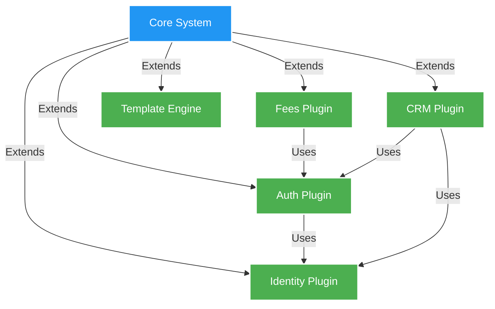

# Building a Plugin-Based Financial System: Architecture Decisions and Lessons Learned

In the world of financial systems, modularity and extensibility aren't just nice-to-have features—they're critical requirements. When we started building Midaz, our open-source ledger for core banking, we faced a crucial architectural decision: how to design a system that could grow and adapt to diverse financial needs while maintaining robustness and consistency?

The answer came in the form of a plugin-based architecture. But what seems like a straightforward decision opens up a world of interesting challenges and trade-offs. Let's dive into how we built Midaz's plugin system and what we learned along the way.

## The Evolution of Financial Systems

Before diving into our plugin architecture, it's worth understanding why traditional monolithic financial systems are becoming increasingly problematic:

1. **Growing Complexity**: Modern financial institutions need to handle everything from traditional banking to cryptocurrency, each with its own rules and requirements
2. **Rapid Market Changes**: New financial products and regulations emerge constantly, requiring quick adaptations
3. **Global Operations**: Different regions have different rules, currencies, and business practices
4. **Integration Challenges**: The need to connect with various third-party services and systems is growing exponentially
5. **Innovation Speed**: Financial institutions need to innovate quickly to stay competitive

We considered three main architectural approaches:

1. **Monolithic Architecture**
   - Pros: Simpler development, easier testing, straightforward deployment
   - Cons: Hard to scale, difficult to maintain, slow to evolve
   - Why we didn't choose it: Lack of flexibility and scalability for modern financial needs

2. **Microservices Architecture**
   - Pros: Independent scaling, technology flexibility, team autonomy
   - Cons: Complex operations, distributed system challenges, higher infrastructure costs
   - Why we didn't choose it: Too granular for our core banking needs, would introduce unnecessary complexity

3. **Plugin Architecture**
   - Pros: Balance of modularity and simplicity, controlled extensibility, clear boundaries
   - Cons: Requires careful design, potential performance overhead
   - Why we chose it: Best balance of flexibility and maintainability for financial systems

## The Case for a Plugin Architecture



Why did we choose a plugin-based architecture? The answer lies in the complex nature of financial systems:

1. **Different institutions, different needs**: Banks, fintechs, and financial institutions often require custom functionality. For example, a cryptocurrency exchange needs different fee structures than a traditional bank. With plugins, each institution can implement its own fee calculation logic without affecting the core system.

2. **Regulatory compliance**: Different regions have different regulatory requirements. A bank operating in both the EU and Asia needs to comply with GDPR and local Asian regulations. Plugins allow for region-specific compliance modules that can be activated as needed.

3. **Scalability concerns**: Not all components need the same level of scalability. While transaction processing might need to handle millions of operations per second, reporting functions might only run periodically. Plugins allow each component to scale independently based on its needs.

4. **Independent evolution**: Components should be able to evolve at their own pace. The authentication system might need frequent updates for security, while the accounting rules might change rarely. Plugin architecture allows each component to be updated independently.

5. **Technology flexibility**: Different teams might prefer different tech stacks for different problems. While the core might be in Go for performance, a machine learning-based fraud detection plugin might be better implemented in Python.

## Real-World Example: Why Plugins Matter

Let's take a real-world scenario to illustrate why this flexibility is crucial. Imagine a traditional bank wanting to add cryptocurrency services:

**Traditional Approach (Without Plugins):**
- Need to modify core banking code
- Risk of affecting existing services
- Long testing cycles
- All-or-nothing deployment
- One size fits all solution

**Plugin-Based Approach:**
- Add a new cryptocurrency plugin
- Core banking remains unchanged
- Isolated testing
- Gradual rollout possible
- Customizable per market/region

## Core Architecture Decisions

Let's look at some key architectural decisions we made and their implications:

```go
// Plugin interface defining the contract for all plugins
type Plugin interface {
    // Initialize is called when the plugin is loaded
    Initialize(ctx context.Context, cfg *Config) error
    
    // Name returns the plugin identifier
    Name() string
    
    // Version returns the plugin version
    Version() string
    
    // Dependencies returns other plugins this one depends on
    Dependencies() []string
    
    // Shutdown is called when the plugin is being unloaded
    Shutdown(ctx context.Context) error
}

// Plugin manager responsible for lifecycle management
type PluginManager struct {
    plugins    map[string]Plugin
    loadOrder  []string
    config     *Config
    middleware []PluginMiddleware
}
```

### 1. Plugin Lifecycle Management

One of our first challenges was managing plugin lifecycles effectively:

```go
func (pm *PluginManager) LoadPlugin(ctx context.Context, p Plugin) error {
    // Validate plugin dependencies
    for _, dep := range p.Dependencies() {
        if _, exists := pm.plugins[dep]; !exists {
            return fmt.Errorf("missing dependency: %s", dep)
        }
    }

    // Initialize with middleware chain
    err := pm.executeMiddlewareChain(ctx, p, func(ctx context.Context, p Plugin) error {
        return p.Initialize(ctx, pm.config)
    })
    if err != nil {
        return fmt.Errorf("failed to initialize plugin %s: %w", p.Name(), err)
    }

    // Store plugin reference
    pm.plugins[p.Name()] = p
    pm.loadOrder = append(pm.loadOrder, p.Name())

    return nil
}
```

This approach allows us to:
- Manage plugin dependencies effectively
- Ensure proper initialization order
- Handle graceful shutdowns
- Apply middleware for cross-cutting concerns

### 2. Inter-Plugin Communication

Communication between plugins was another critical challenge. We implemented a message bus pattern:

```go
// Event bus for inter-plugin communication
type EventBus interface {
    // Publish sends an event to all subscribers
    Publish(ctx context.Context, topic string, event interface{}) error
    
    // Subscribe registers a handler for a specific event type
    Subscribe(topic string, handler EventHandler) error
    
    // Unsubscribe removes a handler
    Unsubscribe(topic string, handler EventHandler) error
}

// Example usage in the Fees plugin
func (f *FeesPlugin) HandleTransaction(ctx context.Context, tx *Transaction) error {
    // Calculate fees
    fees, err := f.calculateFees(ctx, tx)
    if err != nil {
        return err
    }

    // Publish fee calculation event
    return f.eventBus.Publish(ctx, "fees.calculated", &FeeCalculatedEvent{
        TransactionID: tx.ID,
        Fees:         fees,
        Timestamp:    time.Now(),
    })
}
```

This pattern provides:
- Loose coupling between plugins
- Asynchronous processing capabilities
- Easy addition of new functionality
- Observability through event tracking

### 3. Plugin Security and Isolation

Security in a financial system is paramount. We implemented several layers of security:

```go
// Plugin security middleware
func SecurityMiddleware(next PluginHandler) PluginHandler {
    return func(ctx context.Context, p Plugin) error {
        // Verify plugin signature
        if err := verifyPluginSignature(p); err != nil {
            return fmt.Errorf("plugin signature verification failed: %w", err)
        }

        // Set up isolation boundaries
        if err := setupIsolation(p); err != nil {
            return fmt.Errorf("failed to set up isolation: %w", err)
        }

        // Apply resource limits
        if err := applyResourceLimits(p); err != nil {
            return fmt.Errorf("failed to apply resource limits: %w", err)
        }

        return next(ctx, p)
    }
}
```

Key security considerations:
- Plugin signature verification
- Resource isolation and limits
- Access control between plugins
- Audit logging of plugin operations
- Secure configuration management

## Real-World Implementation: The Fees Plugin

Let's look at a concrete example of how we implemented the fees plugin:

```go
// Fee calculation plugin implementation
type FeesPlugin struct {
    config    *Config
    eventBus  EventBus
    repo      Repository
    validator *validation.Validator
}

func (f *FeesPlugin) Initialize(ctx context.Context, cfg *Config) error {
    // Initialize dependencies
    if err := f.initDependencies(cfg); err != nil {
        return fmt.Errorf("failed to initialize dependencies: %w", err)
    }

    // Subscribe to relevant events
    if err := f.eventBus.Subscribe("transaction.created", f.HandleTransaction); err != nil {
        return fmt.Errorf("failed to subscribe to events: %w", err)
    }

    // Set up fee calculation rules
    if err := f.initializeFeeRules(ctx); err != nil {
        return fmt.Errorf("failed to initialize fee rules: %w", err)
    }

    return nil
}

func (f *FeesPlugin) calculateFees(ctx context.Context, tx *Transaction) (*FeeCalculation, error) {
    // Validate transaction
    if err := f.validator.Validate(tx); err != nil {
        return nil, fmt.Errorf("invalid transaction: %w", err)
    }

    // Apply fee rules
    fees := &FeeCalculation{
        TransactionID: tx.ID,
        Timestamp:    time.Now(),
    }

    for _, rule := range f.feeRules {
        if rule.Applies(tx) {
            fee, err := rule.Calculate(tx)
            if err != nil {
                return nil, fmt.Errorf("fee calculation failed: %w", err)
            }
            fees.AddFee(fee)
        }
    }

    return fees, nil
}
```

## Lessons Learned

Building a plugin-based financial system taught us several valuable lessons:

### 1. Plugin Interface Design is Critical

The plugin interface needs to be:
- Stable and backward compatible
- Flexible enough to accommodate future needs
- Simple enough to implement correctly
- Well-documented with clear contracts

### 2. State Management Matters

Managing state across plugins requires careful consideration:
- Clear boundaries for data ownership
- Transaction management across plugin boundaries
- State synchronization strategies
- Cache invalidation policies

### 3. Error Handling is Complex

Error handling in a plugin system requires special attention:

```go
// Error types specific to plugin operations
type PluginError struct {
    Plugin  string
    Code    string
    Message string
    Cause   error
}

func (e *PluginError) Error() string {
    return fmt.Sprintf("plugin %s error: %s (%s)", e.Plugin, e.Message, e.Code)
}

// Error handling middleware
func ErrorHandlingMiddleware(next PluginHandler) PluginHandler {
    return func(ctx context.Context, p Plugin) error {
        err := next(ctx, p)
        if err == nil {
            return nil
        }

        // Wrap plugin errors with context
        if pluginErr, ok := err.(*PluginError); ok {
            return fmt.Errorf("plugin %s failed: %w", p.Name(), pluginErr)
        }

        // Convert unknown errors to plugin errors
        return &PluginError{
            Plugin:  p.Name(),
            Code:    "UNKNOWN_ERROR",
            Message: err.Error(),
            Cause:   err,
        }
    }
}
```

### 4. Testing Strategy is Essential

Testing a plugin-based system requires a comprehensive strategy:

```go
// Plugin test suite
type PluginTestSuite struct {
    suite.Suite
    manager *PluginManager
    mocks   *MockServices
}

func (s *PluginTestSuite) TestPluginLifecycle() {
    // Test plugin initialization
    plugin := NewTestPlugin()
    err := s.manager.LoadPlugin(context.Background(), plugin)
    s.NoError(err)

    // Test plugin operations
    err = plugin.DoSomething()
    s.NoError(err)

    // Test plugin shutdown
    err = s.manager.UnloadPlugin(context.Background(), plugin.Name())
    s.NoError(err)
}

func (s *PluginTestSuite) TestPluginIsolation() {
    // Test resource isolation
    plugin := NewResourceIntensivePlugin()
    err := s.manager.LoadPlugin(context.Background(), plugin)
    s.NoError(err)

    // Verify resource limits are enforced
    err = plugin.ConsumeLotsOfResources()
    s.Error(err)
    s.Contains(err.Error(), "resource limit exceeded")
}
```

Key testing considerations:
- Unit testing individual plugins
- Integration testing between plugins
- System testing of the complete plugin ecosystem
- Performance testing under load
- Chaos testing for resilience

## Future Considerations

As we continue to evolve Midaz's plugin architecture, we're focusing on:

1. **Dynamic Loading**: Ability to load/unload plugins without system restart
2. **Version Management**: Better handling of plugin version compatibility
3. **Monitoring and Observability**: Enhanced visibility into plugin operations
4. **Performance Optimization**: Reducing inter-plugin communication overhead
5. **Developer Experience**: Improving plugin development tooling

## Real-World Impact: A Case Study

Let's look at how this architecture proved its value in a real scenario. One of our users, a regional bank, needed to:
1. Add a new fee structure for premium accounts
2. Implement country-specific tax calculations
3. Integrate with a local payment system

With our plugin architecture, they:
1. Created a custom fee plugin inheriting from our base fee plugin
2. Implemented a tax calculation plugin specific to their region
3. Built a payment system integration plugin

Total implementation time: 6 weeks
Estimated time with traditional architecture: 4-6 months

## The Human Side of Plugin Architecture

One often overlooked aspect of plugin architecture is its impact on teams and organizations:

1. **Team Autonomy**
   - Teams can own specific plugins
   - Clear boundaries reduce conflicts
   - Independent release cycles

2. **Knowledge Management**
   - Easier to maintain expertise in specific areas
   - Better documentation due to clear interfaces
   - Simpler onboarding for new team members

3. **Business Agility**
   - Faster time to market for new features
   - Easier to experiment and roll back changes
   - Better alignment with business capabilities

## Conclusion

Building a plugin-based financial system is a complex but rewarding endeavor. The key is finding the right balance between flexibility and complexity, security and usability, performance and maintainability.

Our experience with Midaz has shown that a well-designed plugin architecture can provide the extensibility needed for modern financial systems while maintaining the robustness required for financial operations.

The journey from concept to implementation taught us valuable lessons about system design, team organization, and the importance of making architectural decisions based on real-world needs rather than theoretical ideals.

Want to explore more? Check out our open-source implementation at our GitHub repository. We'd love to hear your thoughts and experiences with plugin architectures in financial systems.

What challenges have you faced when building extensible financial systems? How have you handled the balance between flexibility and complexity? Let us know in the comments below! 