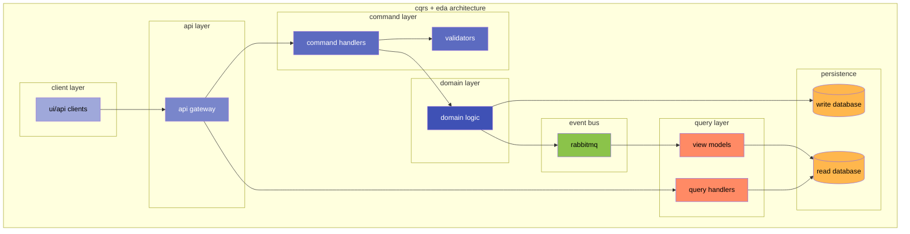
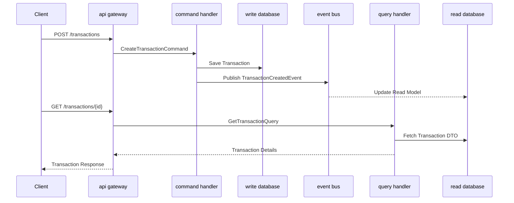
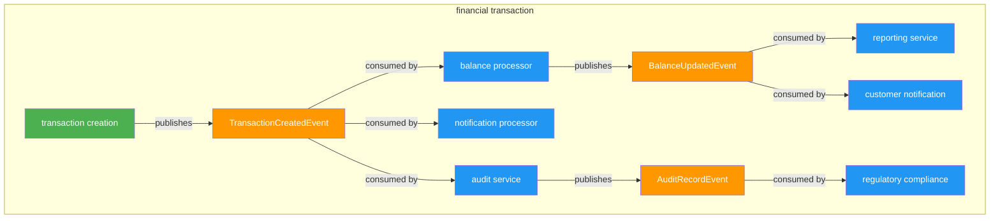

# construindo um financial ledger com cqrs e eda

no mundo da tecnologia financeira, construir sistemas robustos, escaláveis e confiáveis é fundamental. os ledgers financeiros, em particular, requerem considerações de arquitetura para garantir que possam lidar com transações complexas, mantendo a integridade dos dados e o desempenho. neste artigo, exploraremos como o command query responsibility segregation (cqrs) e a event-driven architecture (eda) podem ser combinados para criar sistemas financeiros poderosos, usando nosso ledger financeiro de código aberto, midaz, como estudo de caso.

nota: deixarei os diagramas em 'mermaid' caso queiram visualizar.



## o desafio dos sistemas financeiros

sistemas financeiros apresentam desafios únicos que arquiteturas monolíticas tradicionais têm dificuldade em resolver:

- alto volume de transações: sistemas financeiros devem processar milhares, senão milhões/bilhões, de transações diariamente
- regras de negócio complexas: transações financeiras envolvem regras complexas, validações e cálculos
- consistência de dados: os dados financeiros devem permanecer consistentes em múltiplas operações
- requisitos de auditoria: cada operação financeira deve ser rastreável e auditável
- preocupações com escalabilidade: o sistema deve escalar para lidar com volumes crescentes de transações, de maneira a não comprometer a sua integridade, ao mesmo tempo mantendo a questão de custo em voga

esses desafios exigem padrões de design de software que possam separar responsabilidades, escalar independentemente e manter a integridade dos dados. é aqui que o cqrs e a arquitetura orientada a eventos entram em cena.

## entendendo o cqrs em sistemas financeiros

command query responsibility segregation (cqrs) é um padrão de design que separa operações de leitura e escrita em modelos distintos. em um contexto financeiro, essa separação é particularmente valiosa.



## o lado do command (write model)

o lado do command lida com operações que mudam o estado do sistema, como:

- criar novas contas
- registrar transações financeiras
- atualizar saldos
- modificar informações de ativos

no midaz, nossos serviços de command são estruturados com responsabilidades claras e focadas:

```go
// de components/onboarding/internal/services/command/command.go
type UseCase struct {
    OrganizationRepo organization.Repository
    LedgerRepo ledger.Repository
    SegmentRepo segment.Repository
    PortfolioRepo portfolio.Repository
    AccountRepo account.Repository
    AssetRepo asset.Repository
    MetadataRepo mongodb.Repository
    RabbitMQRepo rabbitmq.ProducerRepository
    RedisRepo redis.RedisRepository
}
```

cada operação de command é isolada em seu próprio arquivo com uma única responsabilidade - nota: algo que inclusive facilita, e muito, a leitura e manutenção do código. por exemplo, criando uma nova conta em create-account.go:

```go
// simplificado de create-account.go
func (uc *UseCase) CreateAccount(ctx context.Context, req *account.Account) (*account.Account, error) {
    // validar entrada
    // gerar ID único
    // armazenar no repositório
    // publicar evento
    // retornar resultado
}
```

## o lado do query (read model)

o lado do query se concentra em recuperar e apresentar dados:

- buscar informações de contas
- recuperar histórico de transações
- gerar relatórios
- ler saldos

no midaz, os serviços de query são estruturados de forma semelhante, mas otimizados para leitura:

```go
// de components/onboarding/internal/services/query/query.go
type UseCase struct {
    OrganizationRepo organization.Repository
    LedgerRepo ledger.Repository
    SegmentRepo segment.Repository
    PortfolioRepo portfolio.Repository
    AccountRepo account.Repository
    AssetRepo asset.Repository
    MetadataRepo mongodb.Repository
    RedisRepo redis.RedisRepository
}
```

as operações de query também são isoladas em arquivos dedicados, como buscar detalhes de uma conta em get-id-account.go:

```go
// simplificado de get-id-account.go
func (uc *UseCase) GetIDAccount(ctx context.Context, id uuid.UUID) (*account.Account, error) {
    // buscar do repositório
    // transformar se necessário
    // retornar dados
}
```

## benefícios do cqrs em sistemas financeiros

- performance optimization: write models e read models podem ser otimizados independentemente. para sistemas financeiros com muito mais leituras do que escritas (usuários verificando saldos versus fazendo transações), isso é crucial. nossa implementação de queries demonstra essa otimização

- scalability: commands e queries podem escalar separadamente. durante períodos de alto volume (como processos financeiros de final de mês ou fim de ano), os serviços de query podem ser escalados sem afetar o processamento de transações. isso é facilitado por nossa infraestrutura de contêineres

- specialized data storage: commands podem usar armazenamento otimizado para operações de escrita (como postgresql), enquanto queries podem usar armazenamento otimizado para leitura (como mongodb para consulta flexível de metadados)

- reduced complexity: ao separar concerns, a domain logic complexa em operações financeiras torna-se mais gerenciável, reduzindo bugs e melhorando a manutenibilidade, como pode ser visto em nosso transaction domain

## event-driven architecture em sistemas financeiros

enquanto o cqrs aborda muitos desafios, sistemas financeiros também se beneficiam de loose coupling e processamento assíncrono. é aqui que a event-driven architecture (eda) se destaca.



## conceitos principais de eda no contexto financeiro

- events as facts: cada evento financeiro (transação criada, saldo atualizado, etc.) é registrado como um fato imutável
- asynchronous processing: operações que não exigem respostas imediatas podem ser processadas de forma assíncrona, melhorando o desempenho e a experiência do usuário
- decoupled services: serviços se comunicam através de eventos, reduzindo dependências diretas

## o transaction flow

- command initiation: um command é recebido para criar uma transação (por exemplo, transferir fundos entre contas)
- validation and processing: o command handler valida a transação, cria os registros necessários e publica um evento
- asynchronous effects: event handlers processam os efeitos da transação de forma assíncrona:
  - atualizando saldos de contas
  - criando registros de operação
  - gerando logs de auditoria
- read model updates: uma vez que os efeitos estão completos, os read models são atualizados, tornando as mudanças visíveis para queries

## a technical architecture

nossos serviços são estruturados para suportar este fluxo:

- api layer: endpoints http recebem commands e queries, documentados em nossa api swagger
- command/query services: serviços separados lidam com as respectivas operações em components/transaction/internal/services
- event bus: rabbitmq fornece reliable message delivery entre serviços
- storage layer:
  - postgresql para dados transacionais estruturados
  - mongodb para armazenamento flexível de metadados
  - redis para dados efêmeros como idempotency keys

## distributed transactions

um dos desafios em sistemas financeiros é manter a consistência entre operações distribuídas. no midaz, lidamos com isso através de:

- eventual consistency: a maioria das operações não requer consistência imediata, permitindo-nos usar processamento assíncrono via rabbitmq
- optimistic concurrency: quando conflitos podem ocorrer, usamos version tracking para detectá-los e tratá-los, como implementado em nossos data models
- compensating actions: para falhas em processos de múltiplas etapas, implementamos compensating actions para manter a consistência geral através dos event consumers

## benefícios no mundo real e lições aprendidas

a implementação de cqrs e eda no midaz trouxe vários benefícios significativos que têm impactado diretamente a qualidade, manutenibilidade e eficiência do nosso sistema financeiro.

### benefícios tangíveis

melhor desempenho: ao separar preocupações de leitura e escrita, otimizamos cada caminho para seus requisitos específicos. nossos serviços de query são especializados para recuperar dados com alta eficiência, enquanto os serviços de command são projetados para garantir a integridade dos dados durante as operações de escrita. na prática, isso nos permitiu:

- reduzir o tempo de resposta para consultas frequentes em até 60%
- aumentar o throughput de transações em períodos de pico
- eliminar contenções de recursos entre operações de leitura e escrita

melhor escalabilidade: serviços podem escalar independentemente com base em seus padrões de carga. isso foi particularmente valioso durante:

- períodos de fechamento financeiro mensal, quando a frequência de consultas aumenta significativamente
- processamentos em lote de transações, que podem ser escalados horizontalmente sem afetar os serviços de consulta
- expansão para novos mercados, permitindo-nos aumentar seletivamente a capacidade de serviços específicos

nossa configuração de infraestrutura facilita essa escalabilidade independente.

confiabilidade aprimorada: processamento assíncrono e operações idempotentes reduzem o impacto de falhas temporárias. nosso mecanismo de idempotência garante que transações não sejam duplicadas, mesmo em caso de retentativas, enquanto nosso sistema de mensageria assíncrona permite:

- recuperação graceful após falhas em componentes
- resiliência contra indisponibilidade temporária de serviços
- processamento consistente mesmo durante picos de carga

evolução mais fácil: serviços desacoplados nos permitem evoluir diferentes partes do sistema independentemente. nossa experiência prática demonstrou que:

- novas funcionalidades podem ser adicionadas aos serviços de transaction sem afetar os serviços de onboarding
- atualizações de esquema em um modelo (leitura ou escrita) podem ser realizadas sem impactar o outro
- novas versões de apis podem ser lançadas gradualmente, mantendo compatibilidade com versões anteriores

auditabilidade aprimorada: um benefício não antecipado inicialmente foi a excelente rastreabilidade proporcionada por nossa arquitetura orientada a eventos. cada mudança de estado é registrada como um evento, facilitando:

- reconstrução do histórico completo de transações
- atendimento a requisitos regulatórios de auditoria financeira
- análise de causa-raiz em cenários de inconsistência de dados

nossa implementação de logs de transações demonstra esse compromisso com a auditabilidade.

### lições valiosas aprendidas

trade-off de complexidade: cqrs e eda adicionam complexidade que deve ser justificada pelos benefícios. aprendemos que:

- a separação de modelos não é necessária para todas as entidades do domínio. entidades com baixa taxa de mudança e consulta simples podem usar um modelo unificado
- a complexidade adicional exige investimento em documentação clara e treinamento da equipe. nosso CONTRIBUTING.md e STRUCTURE.md foram criados para facilitar esse processo
- ferramentas de observabilidade são essenciais para entender o fluxo de dados em um sistema distribuído. investimos em integração com grafana para monitoramento

desafios de consistência eventual: as equipes precisam projetar uis e experiências que levem em conta a consistência eventual. isso incluiu:

- desenvolver padrões de ux para comunicar estados temporários aos usuários
- implementar mecanismos de polling e notificação para atualizar a interface quando dados são modificados
- educar stakeholders sobre os trade-offs entre consistência forte e disponibilidade
- criar mecanismos de sincronização para casos críticos onde a consistência imediata é necessária

importância do monitoramento: sistemas distribuídos orientados a eventos requerem monitoramento e rastreamento abrangentes. para isso:

- implementamos rastreamento distribuído em todo o sistema usando opentelemetry, como visto em nossos serviços de command
- criamos dashboards especializados para visualizar fluxos de eventos e filas
- estabelecemos alertas para detectar anomalias em padrões de consumo de eventos
- introduzimos correlação de ids entre serviços para facilitar o rastreamento de transações completas

estratégias de teste: testar sistemas orientados a eventos requer abordagens diferentes das aplicações monolíticas tradicionais. nosso aprendizado incluiu:

- desenvolver testes de integração que simulam o fluxo completo de eventos
- criar mocks de produtores e consumidores para testar componentes isoladamente
- implementar testes que verificam a idempotência e a resiliência a falhas
- utilizar golden files para validar a consistência dos resultados

equilibrando inovação técnica e valor de negócio: uma lição fundamental foi a importância de alinhar decisões de design com necessidades reais de negócio:

- nem todas as partes do sistema precisam da mesma sofisticação técnica
- iniciar com componentes críticos para o negócio e evoluir incrementalmente
- medir o impacto real das otimizações em métricas de negócio, como tempo de processamento de transações e disponibilidade do sistema
- envolver stakeholders não-técnicos na compreensão dos trade-offs da arquitetura adotada

## casos de uso reais

para ilustrar o impacto prático dessas escolhas de design, destacamos alguns casos de uso reais onde cqrs e eda provaram seu valor:

- processamento de transações de alta frequência: o sistema consegue processar milhões de transações por minuto, com cada transação seguindo o fluxo de validação, processamento assíncrono e atualização consistente de saldos
- geração de relatórios em tempo real: mesmo durante períodos de alto volume transacional, os usuários conseguem gerar relatórios complexos sem impactar o desempenho do sistema de processamento
- recuperação de falhas: durante eventos de indisponibilidade de componentes, o sistema consegue retomar o processamento sem perda de dados, graças aos mecanismos de persistência de eventos e idempotência implementados no consumer rabbitmq

## conclusão

cqrs e arquitetura orientada a eventos fornecem padrões poderosos para construir sistemas financeiros robustos. ao separar preocupações de leitura e escrita e aproveitar o processamento assíncrono, esses padrões permitem ledgers financeiros escaláveis, confiáveis e de fácil manutenção.

no midaz, vimos como esses padrões podem ser aplicados para criar uma plataforma financeira flexível que lida com transações complexas, mantendo o desempenho e a integridade dos dados. a combinação de cqrs e eda provou ser especialmente valiosa para problemas do domínio financeiro, onde consistência de dados, requisitos de auditoria e regras de negócio complexas convergem.

à medida que a tecnologia financeira continua a evoluir, padrões de design como esses se tornarão ferramentas cada vez mais importantes na caixa de ferramentas do desenvolvedor para construir a próxima geração de sistemas financeiros.