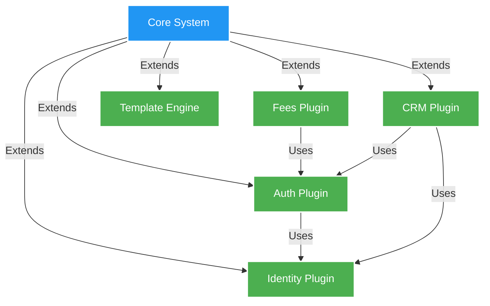

# construindo um sistema financeiro baseado em plugins: decisões de arquitetura e lições aprendidas

no mundo dos sistemas financeiros, modularidade e extensibilidade não são apenas features legais de se ter - são requisitos críticos. quando começamos a construir o midaz, nosso ledger open-source para core banking, enfrentamos uma decisão arquitetural crucial: como projetar um sistema que pudesse crescer e se adaptar a diversas necessidades financeiras, mantendo robustez e consistência?

a resposta veio na forma de uma plugin architecture. mas o que parece uma decisão simples abre um mundo de desafios e trade-offs interessantes. vamos mergulhar em como construímos o sistema de plugins do midaz e o que aprendemos no caminho.

## a evolução dos sistemas financeiros

antes de mergulhar na nossa plugin architecture, vale entender por que os sistemas financeiros monolíticos tradicionais estão se tornando cada vez mais problemáticos:

1. **complexidade crescente**: instituições financeiras modernas precisam lidar com tudo, desde banking tradicional até crypto, cada um com suas próprias regras e requisitos
2. **mudanças rápidas de mercado**: novos produtos financeiros e regulações surgem constantemente, exigindo adaptações rápidas
3. **operações globais**: diferentes regiões têm diferentes regras, moedas e práticas de negócio
4. **desafios de integração**: a necessidade de conectar com vários third-party services e sistemas está crescendo exponencialmente
5. **velocidade de inovação**: instituições financeiras precisam inovar rapidamente para se manterem competitivas

consideramos três principais abordagens arquiteturais:

1. **monolithic architecture**
   - pros: desenvolvimento mais simples, testes mais fáceis, deploy straightforward
   - cons: difícil de escalar, difícil de manter, evolução lenta
   - por que não escolhemos: falta de flexibilidade e escalabilidade para necessidades financeiras modernas

2. **microservices architecture**
   - pros: escalabilidade independente, flexibilidade tecnológica, autonomia dos times
   - cons: operações complexas, desafios de sistemas distribuídos, custos maiores de infra
   - por que não escolhemos: granularidade muito fina para nossas necessidades de core banking, introduziria complexidade desnecessária

3. **plugin architecture**
   - pros: equilíbrio entre modularidade e simplicidade, extensibilidade controlada, boundaries claros
   - cons: requer design cuidadoso, potencial overhead de performance
   - por que escolhemos: melhor equilíbrio entre flexibilidade e manutenibilidade para sistemas financeiros

## o caso para uma plugin architecture



por que escolhemos uma plugin architecture? a resposta está na natureza complexa dos sistemas financeiros:

1. **diferentes instituições, diferentes necessidades**: bancos, fintechs e instituições financeiras frequentemente precisam de funcionalidades customizadas. por exemplo, uma exchange de crypto precisa de estruturas de fees diferentes de um banco tradicional. com plugins, cada instituição pode implementar sua própria lógica de cálculo de fees sem afetar o core system.

2. **compliance regulatório**: diferentes regiões têm diferentes requisitos regulatórios. um banco operando tanto na UE quanto na ásia precisa estar em compliance com GDPR e regulações locais asiáticas. plugins permitem módulos de compliance específicos por região que podem ser ativados conforme necessário.

3. **preocupações de scalability**: nem todos os componentes precisam do mesmo nível de escalabilidade. enquanto o processamento de transações pode precisar lidar com milhões de operações por segundo, funções de relatório podem rodar apenas periodicamente. plugins permitem que cada componente escale independentemente com base em suas necessidades.

4. **evolução independente**: componentes devem poder evoluir em seu próprio ritmo. o sistema de autenticação pode precisar de updates frequentes para segurança, enquanto as regras contábeis podem mudar raramente. a plugin architecture permite que cada componente seja atualizado independentemente.

5. **flexibilidade tecnológica**: diferentes times podem preferir diferentes tech stacks para diferentes problemas. enquanto o core pode estar em go por performance, um plugin de fraud detection baseado em machine learning pode ser melhor implementado em python.

## exemplo do mundo real: por que plugins importam

vamos pegar um cenário real para ilustrar por que essa flexibilidade é crucial. imagine um banco tradicional querendo adicionar serviços de crypto:

**abordagem tradicional (sem plugins):**
- necessidade de modificar o core banking code
- risco de afetar serviços existentes
- ciclos longos de teste
- deployment all-or-nothing
- solução one-size-fits-all

**abordagem baseada em plugins:**
- adicionar um novo crypto plugin
- core banking permanece inalterado
- testes isolados
- rollout gradual possível
- customizável por mercado/região

## decisões core de arquitetura

vamos olhar algumas decisões arquiteturais chave que fizemos e suas implicações:

```go
// interface de plugin definindo o contrato para todos os plugins
type Plugin interface {
    // Initialize é chamado quando o plugin é carregado
    Initialize(ctx context.Context, cfg *Config) error
    
    // Name retorna o identificador do plugin
    Name() string
    
    // Version retorna a versão do plugin
    Version() string
    
    // Dependencies retorna outros plugins que este depende
    Dependencies() []string
    
    // Shutdown é chamado quando o plugin está sendo descarregado
    Shutdown(ctx context.Context) error
}

// plugin manager responsável pelo lifecycle management
type PluginManager struct {
    plugins    map[string]Plugin
    loadOrder  []string
    config     *Config
    middleware []PluginMiddleware
}
```

### 1. plugin lifecycle management

um dos nossos primeiros desafios foi gerenciar lifecycles de plugins efetivamente:

```go
func (pm *PluginManager) LoadPlugin(ctx context.Context, p Plugin) error {
    // validar dependencies do plugin
    for _, dep := range p.Dependencies() {
        if _, exists := pm.plugins[dep]; !exists {
            return fmt.Errorf("missing dependency: %s", dep)
        }
    }

    // inicializar com middleware chain
    err := pm.executeMiddlewareChain(ctx, p, func(ctx context.Context, p Plugin) error {
        return p.Initialize(ctx, pm.config)
    })
    if err != nil {
        return fmt.Errorf("failed to initialize plugin %s: %w", p.Name(), err)
    }

    // armazenar referência do plugin
    pm.plugins[p.Name()] = p
    pm.loadOrder = append(pm.loadOrder, p.Name())

    return nil
}
```

essa abordagem nos permite:
- gerenciar dependencies de plugins efetivamente
- garantir ordem correta de inicialização
- lidar com graceful shutdowns
- aplicar middleware para cross-cutting concerns

### 2. comunicação inter-plugin

a comunicação entre plugins foi outro desafio crítico. implementamos um padrão de message bus:

```go
// event bus para comunicação inter-plugin
type EventBus interface {
    // publish envia um evento para todos os subscribers
    Publish(ctx context.Context, topic string, event interface{}) error
    
    // subscribe registra um handler para um tipo específico de evento
    Subscribe(topic string, handler EventHandler) error
    
    // unsubscribe remove um handler
    Unsubscribe(topic string, handler EventHandler) error
}

// exemplo de uso no fees plugin
func (f *FeesPlugin) HandleTransaction(ctx context.Context, tx *Transaction) error {
    // calcular fees
    fees, err := f.calculateFees(ctx, tx)
    if err != nil {
        return err
    }

    // publicar evento de cálculo de fee
    return f.eventBus.Publish(ctx, "fees.calculated", &FeeCalculatedEvent{
        TransactionID: tx.ID,
        Fees:         fees,
        Timestamp:    time.Now(),
    })
}
```

esse pattern fornece:
- loose coupling entre plugins
- capacidades de processamento assíncrono
- fácil adição de nova funcionalidade
- observability através de event tracking

### 3. segurança e isolamento de plugins

segurança em um sistema financeiro é fundamental. implementamos várias camadas de segurança:

```go
// middleware de segurança de plugin
func SecurityMiddleware(next PluginHandler) PluginHandler {
    return func(ctx context.Context, p Plugin) error {
        // verificar assinatura do plugin
        if err := verifyPluginSignature(p); err != nil {
            return fmt.Errorf("plugin signature verification failed: %w", err)
        }

        // configurar boundaries de isolamento
        if err := setupIsolation(p); err != nil {
            return fmt.Errorf("failed to set up isolation: %w", err)
        }

        // aplicar limites de recursos
        if err := applyResourceLimits(p); err != nil {
            return fmt.Errorf("failed to apply resource limits: %w", err)
        }

        return next(ctx, p)
    }
}
```

considerações chave de segurança:
- verificação de assinatura de plugin
- isolamento de recursos e limites
- controle de acesso entre plugins
- audit logging de operações de plugin
- gerenciamento seguro de configuração

## implementação real: o fees plugin

vamos olhar um exemplo concreto de como implementamos o fees plugin:

```go
// implementação do plugin de cálculo de fees
type FeesPlugin struct {
    config    *Config
    eventBus  EventBus
    repo      Repository
    validator *validation.Validator
}

func (f *FeesPlugin) Initialize(ctx context.Context, cfg *Config) error {
    // inicializar dependencies
    if err := f.initDependencies(cfg); err != nil {
        return fmt.Errorf("failed to initialize dependencies: %w", err)
    }

    // subscrever em eventos relevantes
    if err := f.eventBus.Subscribe("transaction.created", f.HandleTransaction); err != nil {
        return fmt.Errorf("failed to subscribe to events: %w", err)
    }

    // configurar regras de cálculo de fee
    if err := f.initializeFeeRules(ctx); err != nil {
        return fmt.Errorf("failed to initialize fee rules: %w", err)
    }

    return nil
}

func (f *FeesPlugin) calculateFees(ctx context.Context, tx *Transaction) (*FeeCalculation, error) {
    // validar transação
    if err := f.validator.Validate(tx); err != nil {
        return nil, fmt.Errorf("invalid transaction: %w", err)
    }

    // aplicar regras de fee
    fees := &FeeCalculation{
        TransactionID: tx.ID,
        Timestamp:    time.Now(),
    }

    for _, rule := range f.feeRules {
        if rule.Applies(tx) {
            fee, err := rule.Calculate(tx)
            if err != nil {
                return nil, fmt.Errorf("fee calculation failed: %w", err)
            }
            fees.AddFee(fee)
        }
    }

    return fees, nil
}
```

## lições aprendidas

construir um sistema financeiro baseado em plugins nos ensinou várias lições valiosas:

### 1. o design da interface de plugin é crítico

a interface do plugin precisa ser:
- estável e backward compatible
- flexível o suficiente para acomodar necessidades futuras
- simples o suficiente para implementar corretamente
- bem documentada com contratos claros

### 2. gerenciamento de estado importa

gerenciar estado entre plugins requer consideração cuidadosa:
- boundaries claros para ownership de dados
- gerenciamento de transações entre boundaries de plugins
- estratégias de sincronização de estado
- políticas de invalidação de cache

### 3. tratamento de erros é complexo

o tratamento de erros em um sistema de plugins requer atenção especial:

```go
// tipos de erro específicos para operações de plugin
type PluginError struct {
    Plugin  string
    Code    string
    Message string
    Cause   error
}

func (e *PluginError) Error() string {
    return fmt.Sprintf("plugin %s error: %s (%s)", e.Plugin, e.Message, e.Code)
}

// middleware de tratamento de erro
func ErrorHandlingMiddleware(next PluginHandler) PluginHandler {
    return func(ctx context.Context, p Plugin) error {
        err := next(ctx, p)
        if err == nil {
            return nil
        }

        // wrap plugin errors com contexto
        if pluginErr, ok := err.(*PluginError); ok {
            return fmt.Errorf("plugin %s failed: %w", p.Name(), pluginErr)
        }

        // converter erros desconhecidos para plugin errors
        return &PluginError{
            Plugin:  p.Name(),
            Code:    "UNKNOWN_ERROR",
            Message: err.Error(),
            Cause:   err,
        }
    }
}
```

### 4. estratégia de testes é essencial

testar um sistema baseado em plugins requer uma estratégia abrangente:

```go
// suite de testes de plugin
type PluginTestSuite struct {
    suite.Suite
    manager *PluginManager
    mocks   *MockServices
}

func (s *PluginTestSuite) TestPluginLifecycle() {
    // testar inicialização do plugin
    plugin := NewTestPlugin()
    err := s.manager.LoadPlugin(context.Background(), plugin)
    s.NoError(err)

    // testar operações do plugin
    err = plugin.DoSomething()
    s.NoError(err)

    // testar shutdown do plugin
    err = s.manager.UnloadPlugin(context.Background(), plugin.Name())
    s.NoError(err)
}

func (s *PluginTestSuite) TestPluginIsolation() {
    // testar isolamento de recursos
    plugin := NewResourceIntensivePlugin()
    err := s.manager.LoadPlugin(context.Background(), plugin)
    s.NoError(err)

    // verificar se limites de recursos são aplicados
    err = plugin.ConsumeLotsOfResources()
    s.Error(err)
    s.Contains(err.Error(), "resource limit exceeded")
}
```

considerações chave de testes:
- unit testing de plugins individuais
- integration testing entre plugins
- system testing do ecossistema completo de plugins
- performance testing sob carga
- chaos testing para resiliência

## considerações futuras

conforme continuamos a evoluir a plugin architecture do midaz, estamos focando em:

1. **dynamic loading**: habilidade de carregar/descarregar plugins sem restart do sistema
2. **version management**: melhor tratamento de compatibilidade de versões de plugins
3. **monitoring e observability**: visibilidade aprimorada nas operações de plugins
4. **otimização de performance**: reduzindo overhead de comunicação inter-plugin
5. **developer experience**: melhorando ferramentas de desenvolvimento de plugins

## impacto no mundo real: um case study

vamos olhar como essa arquitetura provou seu valor em um cenário real. um dos nossos usuários, um banco regional, precisava:
1. adicionar uma nova estrutura de fees para contas premium
2. implementar cálculos de impostos específicos do país
3. integrar com um sistema de pagamento local

com nossa plugin architecture, eles:
1. criaram um custom fee plugin herdando do nosso base fee plugin
2. implementaram um plugin de cálculo de impostos específico para sua região
3. construíram um plugin de integração com sistema de pagamento

tempo total de implementação: 6 semanas
tempo estimado com arquitetura tradicional: 4-6 meses

## o lado humano da plugin architecture

um aspecto frequentemente negligenciado da plugin architecture é seu impacto em times e organizações:

1. **autonomia dos times**
   - times podem ter ownership de plugins específicos
   - boundaries claros reduzem conflitos
   - ciclos de release independentes

2. **gestão de conhecimento**
   - mais fácil manter expertise em áreas específicas
   - melhor documentação devido a interfaces claras
   - onboarding mais simples para novos membros do time

3. **agilidade de negócio**
   - time to market mais rápido para novas features
   - mais fácil experimentar e fazer rollback de mudanças
   - melhor alinhamento com capacidades de negócio

## conclusão

construir um sistema financeiro baseado em plugins é um desafio complexo mas recompensador. a chave é encontrar o equilíbrio certo entre flexibilidade e complexidade, segurança e usabilidade, performance e manutenibilidade.

nossa experiência com o midaz mostrou que uma plugin architecture bem projetada pode fornecer a extensibilidade necessária para sistemas financeiros modernos, mantendo a robustez necessária para operações financeiras.

a jornada do conceito à implementação nos ensinou lições valiosas sobre design de sistema, organização de time e a importância de tomar decisões arquiteturais baseadas em necessidades do mundo real ao invés de ideais teóricos.

quer explorar mais? confira nossa implementação open-source no nosso repositório do github. adoraríamos ouvir seus pensamentos e experiências com plugin architectures em sistemas financeiros.

quais desafios você enfrentou ao construir sistemas financeiros extensíveis? como você lidou com o equilíbrio entre flexibilidade e complexidade? nos conte nos comentários abaixo! 